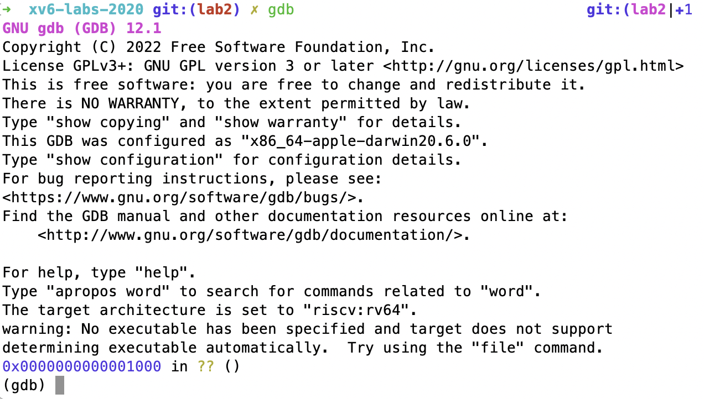

# 闲话、gdb

## 闲话

自打syscall lab以来，三天都没看MIT 6.S081🤣，今天扫了一下下一节课的内容，发现居然！！！ 居然是讲实验二的内容🤡...

讲的大概就是上一篇[博客](../lab2-system-calls)中"[准备](../lab2-system-calls/#准备)"那一小节的内容，前几天做syscall lab时还奇怪呢，怎么这个实验内容不带讲的，全靠自己看是吧，还看了有几个小时......

官网上的课程表长这个样


实验二并没有对应的课程，但是当你往下一看


逆天呀，原来是先布置实验，过几天才上对应的课😨

由于已经做过实验二了，就不仔细看这节课了，象征性的扫了一下，贴几个链接如下

- 好心人的课程翻译: https://mit-public-courses-cn-translatio.gitbook.io/mit6-s081/lec03-os-organization-and-system-calls
- 课程视频: https://www.bilibili.com/video/BV19k4y1C7kA?p=2&vd_source=a47945b9c45a33522fa3c242107add1e

---

## GDB

在上面讲到的那节课中，最后在描述xv6大致启动过程时，老师用到了GDB来跟踪启动时执行的代码，之前还没用过gdb来调试xv6，于是也尝试了一下

### 启动

使用如下命令启动xv6

```bash
make CPUS=1 qemu-gdb
```

CPUS设定模拟的核数，设为1是因为一个CPU容易调试，启动后效果如下


### docker环境下启动gdb

上面的xv6是跑在docker容器内的(见[环境配置](../xv6-环境配置))，直接在docker内使用gdb，效果如下


启动时报了这样的一个警告，说是`auto-loading has been declined`，gdb在启动时会自动执行当前目录内的`.gdbinit`内的命令，在实验目录下该文件内容如下


执行完这些命令就已经设置好了gdb客户端，可以开始调试xv6，但是docker内的gdb说要添加`safe-path`，按照提示向`/root/.config/gdb/gdbinit`添加如下内容


直接将`/xwk`目录设置为`safe-path`，再次启动gdb，效果如下


结果还是有问题，这个普通的`gdb`都不支持`riscv:rv64`。回忆起之前[环境配置](../xv6-环境配置/#安装riscv-tools)时，安装了一个`gdb-multiarch`，看名字就是多architechture的gdb，尝试使用`gdb-multiarch`，结果如下


上图结果和课程录像一致，也可以正常进行调试。

---

### mac下的gdb

尝试在实验目录下(这样才能执行`.gdbinit`)直接启动macOS下安装的gdb，发现macOS下用brew装的gdb居然支持`riscv:rv64`，真是太好了😋！

可是docker内的25000端口没有暴露😅，只好重新开一个容器了，先把已有的容器commit，再新建容器

```bash
docker commit -a "..." -m "..." xv6 dev:latest # 将容器commit成镜像
docker container rm xv6  # 删除xv6容器
docker run -itd --name xv6 \
	-p 8080:22 \  # ssh端口
	\p 25000:25000 \ # gdb服务器端口
	-v ...:...      # 挂载实验目录
```

重新执行下面语句启动xv6并启动gdb服务器

```bash
make CPUS=1 qemu-gdb
```

接着直接在macOS下启动gdb，如下



大功告成😤

---

## 尾声

因为科研组的关系，接下来可能得看一些深度学习相关的东西了，那OS就会比以前更慢了😨，看一节课是一节课吧🤣