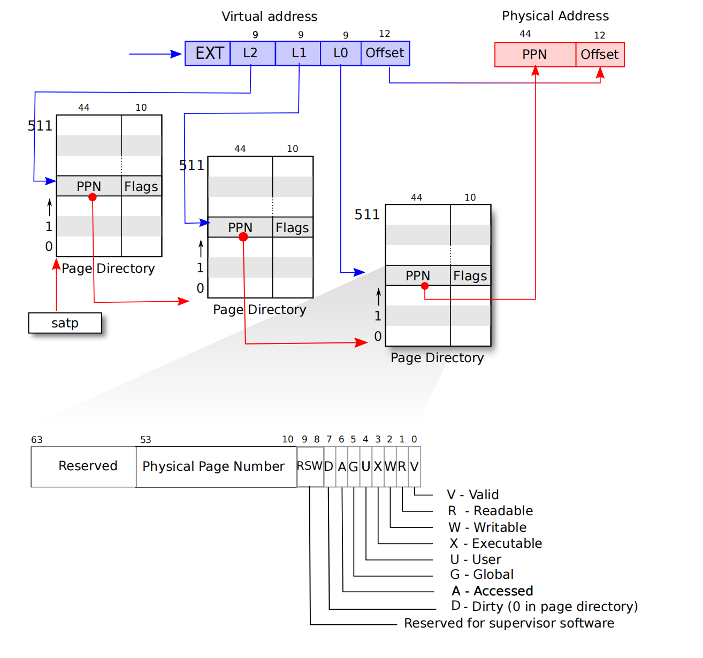
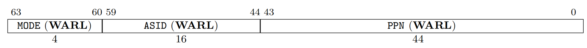
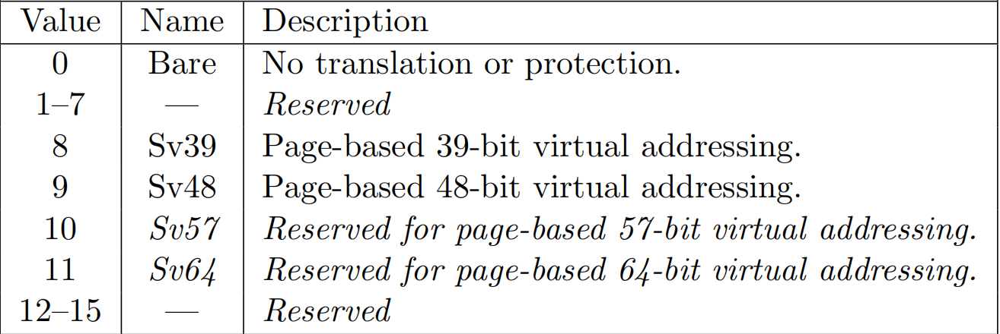
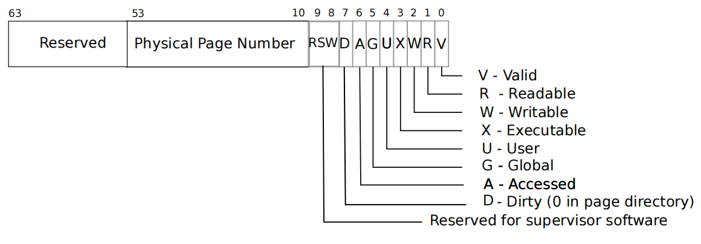
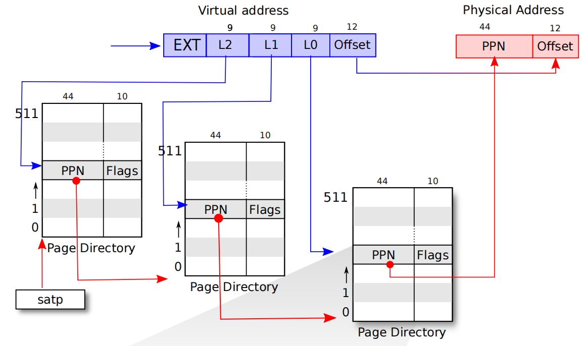
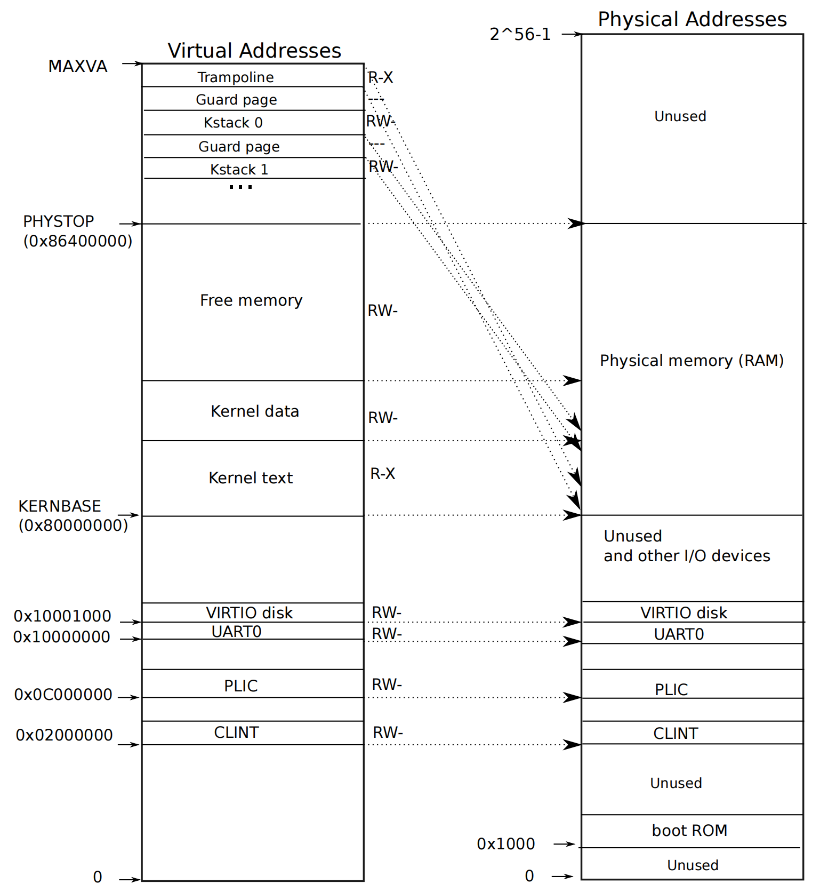
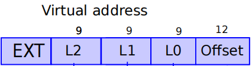
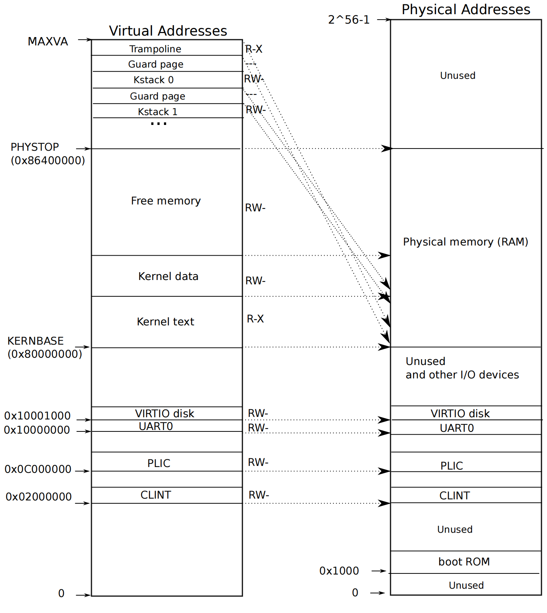
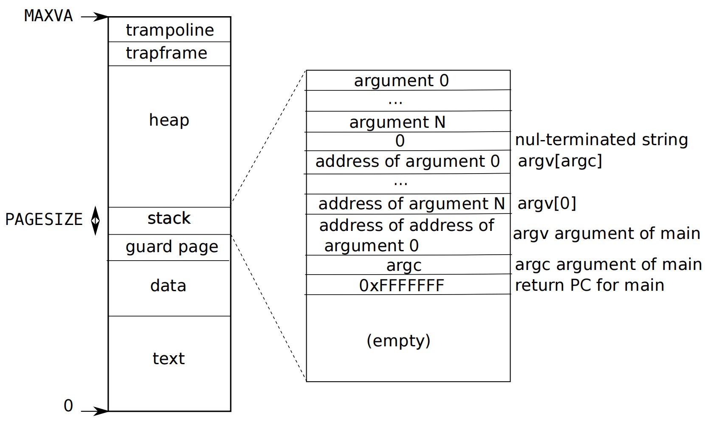

# xv6 page table相关代码解析

距离上一次实验过了12天啦🤣，险些就中道崩殂了🙃

不过虽然久了点，好歹还是完成了第三个实验，也就是传说中的page table相关的实验。这部分实验需要理解riscv处理器的寻址方式，并明白xv6源码中和page table相关的部分代码是如何工作的。

在本篇内容中先不讲实现，先看看源码中的相关部分究竟在做什么😤

---

## riscv 寻址方式

首先要弄清楚riscv的寻址方式，寻址示意图如下



riscv中虚拟地址为64位，物理地址为56位(做硬件的设计的，他们觉得目前以及短时间的未来够用了吧)，内存相关硬件可以使用分页机制，规定一页内存大小为4096 bytes($2^{12}$字节)。由于一页4096字节，故虚拟地址(virtual address，简称 `va`)和物理地址(physical address，简称`pa`)使用12位作为页内偏移(offset)。`pa`的高44位为物理页号(physical page number，简称`ppn`).

### satp寄存器

从前面的那张图可以看到，riscv采用三级页表，将三级页表分别记为`L2`、`L1`、`L0`其中2级为最高，0级为最低。每一张页表占据4096字节，即占据一个页的大小，故页表首地址设计为按页对齐，这样就只需要记录`ppn`即可知道页表的位置了。

`L2`页表的`ppn`记录在一个特殊的寄存器中，寄存器全程为:**Supervisor Address Translation and Protection (**satp**) Register**，根据[手册](https://riscv.org/wp-content/uploads/2017/05/riscv-privileged-v1.10.pdf)，该寄存器结构如下图所示



在这里先解释一些概念如下

- **CSR**: Control and Status Register，顾名思义，有着控制作用或者记录状态的寄存器，即有着特殊作用的寄存器，一般只有特权指令会用到这些寄存器。
- **WARL**: Write Any Values, Reads Legal Values.即可以写入任何值，但只能读到合法值，也就是说如果写入不合法值，那写入不会生效的，下次读到的还是合法值。

**satp**就是一个**CSR**，其中包含三个部分：`MODE`、`ASID`和`PPN`，作用如下

- `PPN`:即`L2`页表的`ppn`，该`ppn`低位填12个0即为`L2`页表所在的物理地址。
- `ASID`：不太清楚具体干啥的，[手册](https://riscv.org/wp-content/uploads/2017/05/riscv-privileged-v1.10.pdf)描述为: an address space identififier (ASID), which facilitates address-translation fences on a per-address-space basis.
- `MODE`:控制`va`到`pa`的转换模式。

`MODE`字段可选值即作用如下



其中8即为xv6使用的`MODE`，即使用基于分页机制的39位虚拟地址。从图1也可以看出，虚拟地址虽然有64位，但只有低39位有用，这就是因为xv6将`MODE`设为了8.

### 页表、页表项

如图1所示，一张页表包含512项，每一项称为**页表项**(Page Table Entry, **PTE**)，每一项占64 bits，如前面所述，一张页表占$512 \times 64 \ bits = 4096 \ bytes$，为一页的大小。

$PTE$的结构如下



其中54-63为保留位，10-53这44 bits为低一级页表的`ppn`或直接是最终物理地址的`ppn`(`L0`页表内的$PTE$中的`ppn`为最终物理地址`ppn`).

0-9这10位为权限设置标志，作用顾名思义。*注意，在读代码时发现，`L2`、`L1`这两级页表中貌似只用到`V`这个位，`L0`级页表才用到别的各个位。*

### 寻址方式

如前文所说，xv6使用$Sv39$，虚拟地址只使用低39位，低12位为$offset$，剩下$27\ bits$分为三部分，每一部分$9\ bits$(对应512个$PTE$)，分别为三级页表的索引，产生最终物理地址方式见下图



---

## 物理地址layout

由之前学过的数字逻辑、计算机组成原理可以知道，地址不仅仅可以用来映射到RAM，其实还可以通过MUX(multiplexer 多路选择器)来将不同地址映射到不同硬件设备，如ROM、RAM、别的IO设备等等，xv6系统使用的模拟环境下物理地址空间的布局如下图右半部分所示



上图中$KERNBASE$和$PHYSTOP$之间的空间即为xv6使用的RAM空间，$KERNBASE$之下的空间要么没用，要么是别的一些硬件，如$0x1000$处为启动代码所在的ROM.

---

## 物理内存分配

riscv采用分页机制，内存分配以页为单位，如前文所示，从KERNBASE开始为RAM，到PHYSTOP为止。内核的代码和数据库从KERNBASE开始装载，内核代码和数据结束后一直到PHYSTOP都是空闲的可以分配的内存空间，xv6的内存分配器就从这一块空间来分配空闲页。

在[启动流程概述](../lab2-system-calls/#启动流程概述)中说过，内核代码最从`entry.S`开始执行，初始化各个处理器的sp寄存器(即栈)，然后跳到`start.c`中的`start()`，在对硬件进行一些设置后，通过`mret`指令跳转到`main.c`中的`main()`函数，同时进入supervisor模式，`main()`函数截取部分如下

```c
// start() jumps here in supervisor mode on all CPUs.
void
main()
{
  if(cpuid() == 0){
    consoleinit();
#if defined(LAB_PGTBL) || defined(LAB_LOCK)
    statsinit();
#endif
    printfinit();
    printf("\n");
    printf("xv6 kernel is booting\n");
    printf("\n");
    kinit();         // physical page allocator
    ...
  } else {
    ...
  }

  scheduler();        
}
```

**（注意在执行这部分代码的时候，satp寄存器的mode还没有设置成开启分页机制，此时虚拟地址不经翻译直接作为物理地址，故下面用到的地址均为前文中物理内存布局描述的那样）**其中`kinit()`函数就是对空闲页分配器的初始化操作，接下来看看这个分配器的实现，源码见`kalloc.c`，`kinit()`函数如下

```c
extern char end[]; // first address after kernel.
                   // defined by kernel.ld.

void
kinit()
{
  initlock(&kmem.lock, "kmem");
  freerange(end, (void*)PHYSTOP);
}
```

由于还没学到锁，第一句`initlock`先不管，`end`为内核代码和数据结束后的首地址，定义见链接脚本`kernel.ld`（暂时没学过链接脚本，可以参考 [该文章](https://web.mit.edu/rhel-doc/3/rhel-ld-en-3/scripts.html)，`PHYSTOP`意义见前一节，定义在`memlayout.h`中。接着看看接受了`end`和`PHYSTOP`参数的`freerange`干了啥，该函数如下

```c
// define in riscv.h
#define PGROUNDUP(sz)  (((sz)+PGSIZE-1) & ~(PGSIZE-1))

void
freerange(void *pa_start, void *pa_end)
{
  char *p;
  p = (char*)PGROUNDUP((uint64)pa_start);
  for(; p + PGSIZE <= (char*)pa_end; p += PGSIZE)
    kfree(p);
}
```

可以看到，该函数对`pa_start`到`pa_end`之间所有完整的页的首地址均调用了一次`kfree`函数，接着在看看`kfree`干什么，如下

```c
struct run {
  struct run *next;
};

struct {
  struct spinlock lock;
  struct run *freelist;
} kmem;

// Free the page of physical memory pointed at by v,
// which normally should have been returned by a
// call to kalloc().  (The exception is when
// initializing the allocator; see kinit above.)
void
kfree(void *pa)
{
  struct run *r;

  if(((uint64)pa % PGSIZE) != 0 || (char*)pa < end || (uint64)pa >= PHYSTOP)
    panic("kfree");

  // Fill with junk to catch dangling refs.
  memset(pa, 1, PGSIZE);

  r = (struct run*)pa;

  acquire(&kmem.lock);
  r->next = kmem.freelist;
  kmem.freelist = r;
  release(&kmem.lock);
}
```

在这篇文章中先忽略`lock`是怎么实现的，就算他是对的。上面的`kfree`函数首先检测给的地址是不是页的首地址以及给定地址范围是否正确，接着往该要释放的空间填入垃圾数据(这是为了让使用已释放内存的程序尽快崩溃)，最后使用该页的开头一小部分空间填充一个`struct run`结构，将该节点串进`kmem.freelist`这个链表内。

故执行完`freerange`后，可用的空闲页均被串进了`kmem.freelist`这个空闲链表内了，分配器初始化完毕。

`kinit`分配器初始化函数分析完毕，顺带将释放页的函数`kfree`也看过了，接着看看分配空闲页的函数，如下

```c
// Allocate one 4096-byte page of physical memory.
// Returns a pointer that the kernel can use.
// Returns 0 if the memory cannot be allocated.
void *
kalloc(void)
{
  struct run *r;

  acquire(&kmem.lock);
  r = kmem.freelist;
  if(r)
    kmem.freelist = r->next;
  release(&kmem.lock);

  if(r)
    memset((char*)r, 5, PGSIZE); // fill with junk
  return (void*)r;
}
```

可以看到该分配函数非常简单，从`kmem.freelist`中取出一个空闲页返回即可。

---

本小节看到了一个极简内存分配器的工作方式，书上学过的理论知识一点都没有用到捏😀，毕竟xv6只是个极简的教学操作系统。不过也看到了真正的一个分配器也算有所收获。

## 内核地址空间

***注意：指令中用到的所有地址均为虚拟地址，虚拟地址如何转换为物理地址由satp中的MODE决定，到目前为止，我们还没有开启分页机制，不进行地址翻译，即虚拟地址直接作为物理地址。***

### walk

该函数在xv6和page table相关的代码中可以说是基石般的存在，因此本文先从该函数讲起，该函数的行为就是模拟MMU的行为，找到一个`VA`在page table中对应的`pte`对应的条目，具体细节待会再说。

#### 相关的宏

在`riscv.h`中定义了很多相关的宏，挑选一些列举如下

```c
#define PGSIZE 4096 // bytes per page
#define PGSHIFT 12  // bits of offset within a page

#define PGROUNDUP(sz)  (((sz)+PGSIZE-1) & ~(PGSIZE-1))
#define PGROUNDDOWN(a) (((a)) & ~(PGSIZE-1))

// shift a physical address to the right place for a PTE.
#define PA2PTE(pa) ((((uint64)pa) >> 12) << 10)

#define PTE2PA(pte) (((pte) >> 10) << 12)

// extract the three 9-bit page table indices from a virtual address.
#define PXMASK          0x1FF // 9 bits
#define PXSHIFT(level)  (PGSHIFT+(9*(level)))
#define PX(level, va) ((((uint64) (va)) >> PXSHIFT(level)) & PXMASK)

// one beyond the highest possible virtual address.
// MAXVA is actually one bit less than the max allowed by
// Sv39, to avoid having to sign-extend virtual addresses
// that have the high bit set.
#define MAXVA (1L << (9 + 9 + 9 + 12 - 1))

#define PTE_V (1L << 0) // valid
#define PTE_R (1L << 1)
#define PTE_W (1L << 2)
#define PTE_X (1L << 3)
#define PTE_U (1L << 4) // 1 -> user can access
```

各个宏的意义都比较明显，从名字就可以看出功能。在这里解释一下`PX`这个宏，这个宏是用来取出一个`va`中`L2`、`L1`、`L0`这几部分对应的数字的



如上图，`PX(2,va)`即为图中`L2`部分的数字，同理`PX(1,va)`和`PX(0,va)`为上图中`L1`和`L0`对应的数字。

#### 类型定义

同样在`riscv.h`中定义了几个有用的类型

```c
typedef uint64 pte_t;
typedef uint64 *pagetable_t; // 512 PTEs
```

其中`pte_t`即为前面讲过的Page table entry，一个`pte`64位，故其实就是`uint64`.而一个`pagetable_t`即一张页表的首地址，故其实际类型为`uint64 *`，其实就是`pte_t *`，前文说到过，一张页表占一页，即4096 bytes，有512个`pte`.

#### walk功能

`walk`函数功能其实就是给定一个`va`和根页表(即前文说的`L2`级的页表)，根据`va`找到对应的`pte`，并将该`pte`的地址返回，函数定义如下

```c
pte_t * walk(pagetable_t pagetable, uint64 va, int alloc)
{
  if(va >= MAXVA)  // va 超范围 panic
    panic("walk");

  for(int level = 2; level > 0; level--) { // 从最高一级页表开始逐层找pte
    pte_t *pte = &pagetable[PX(level, va)]; // 找到该层对应的pte
    if(*pte & PTE_V) {                      // 该pte有效则找到了，往下走一层
      pagetable = (pagetable_t)PTE2PA(*pte);
    } else {                              
      if(!alloc || (pagetable = (pde_t*)kalloc()) == 0) // 如果alloc != 0则会分配一张页表
        return 0;                                       // alloc == 0 或者 分配空闲页失败 返回0
      memset(pagetable, 0, PGSIZE);                     // 分配的页做空页表，pte全设为0
      *pte = PA2PTE(pagetable) | PTE_V;                 // 接着往下走
    }
  }
  return &pagetable[PX(0, va)];                  // 返回pte对应的地址
}
```

上面的walk函数不仅可以模仿MMU找到`pte`，还可以通过`alloc`参数控制分配本来不存在的页表。这个功能非常有用，比如现在某个`va`在页表中没有对应的项，可以通过`walk(pg,va,1)`来在页表中创建原本没有的页表，最后返回`va`对应的`pte`地址，设置`pte`即可配置`va`映射到哪个物理地址以及对应的权限了。从这里也可以看出三级页表的好处，没用到的项不会分配空间，相比一级页表占用空间少。

### mappages

有了`walk`函数，可以很容易的把某个`va`映射到对应的`pa`上并设置对应权限，具体方法在上面描述了一下，在源码中，封装了一个`mappages`函数专门做`va`到`pa`的映射，该函数定义如下

```c
// Create PTEs for virtual addresses starting at va that refer to
// physical addresses starting at pa. va and size might not
// be page-aligned. Returns 0 on success, -1 if walk() couldn't
// allocate a needed page-table page.
int
mappages(pagetable_t pagetable, uint64 va, uint64 size, uint64 pa, int perm)
{
  uint64 a, last;
  pte_t *pte;

  a = PGROUNDDOWN(va);  // 开始要做映射的虚拟页
  last = PGROUNDDOWN(va + size - 1);  // 最后一页要做映射的虚拟页
  for(;;){
    if((pte = walk(pagetable, a, 1)) == 0) // 此处walk的alloc 为1 需要分配本来没有的页表
      return -1; // 分配失败
    if(*pte & PTE_V) // 这个va已经映射过了，重新映射也许是无意为之，panic以提前发现错误
      panic("remap");
    *pte = PA2PTE(pa) | perm | PTE_V;  // 设置ppn和flag，即映射到的物理地址和访问权限
    if(a == last)   // 分配完毕
      break;
    a += PGSIZE;   // 下一页
    pa += PGSIZE;  // 下一页
  }
  return 0;
}
```

有了`mappages`，可以很容易的将一块连续的虚拟地址空间映射到一块连续的物理地址空间上。

### kvmmap

命名有迹可循，k是指kernel，vm是virtual memory，kvm开头的函数和内核的虚拟地址空间有关。u是user，uvm开头的函数和用户的虚拟地址空间有关，其中`kvmmap`是给内核使用的页表做映射，其实就是对`mappages`的封装，其定义如下

```c
// add a mapping to the kernel page table.
// only used when booting.
// does not flush TLB or enable paging.
void
kvmmap(uint64 va, uint64 pa, uint64 sz, int perm)
{
  if(mappages(kernel_pagetable, va, sz, pa, perm) != 0)
    panic("kvmmap");
}
```

其中的`kernel_pagetable`是一个全局变量，即内核的页表，在后面会看到该变量在哪里初始化。

### 内核地址空间初始化

在[物理内存分配](#物理内存分配)那一小节说过，系统启动时，`main`通过调用`kinit`初始化了内存分配器，再回过头看看`main`如下

```c
// start() jumps here in supervisor mode on all CPUs.
void
main()
{
  if(cpuid() == 0){
    consoleinit();
#if defined(LAB_PGTBL) || defined(LAB_LOCK)
    statsinit();
#endif
    printfinit();
    printf("\n");
    printf("xv6 kernel is booting\n");
    printf("\n");
    kinit();         // physical page allocator
    kvminit();       // create kernel page table
    kvminithart();   // turn on paging
    procinit();      // process table
    ...  
    userinit();      // first user process
   ...
  } else {
    ...
  }

  scheduler();        
}
```

`kinit`函数接下去就是`kvminit`，该函数初始化内核的虚拟地址空间，即设置内核的页表，其定义如下

```c
// 辅助函数，定义在string.c 顾名思义，设置内存的
void* memset(void *dst, int c, uint n)
{
  char *cdst = (char *) dst;
  int i;
  for(i = 0; i < n; i++){
    cdst[i] = c;
  }
  return dst;
}

/*
 * the kernel's page table.
 */
pagetable_t kernel_pagetable;

void kvminit()
{
  kernel_pagetable = (pagetable_t) kalloc();  // 根页表首先需要分配一页空间
  memset(kernel_pagetable, 0, PGSIZE);        // 全部pte设为0
  // uart registers
  kvmmap(UART0, UART0, PGSIZE, PTE_R | PTE_W);
  // virtio mmio disk interface
  kvmmap(VIRTIO0, VIRTIO0, PGSIZE, PTE_R | PTE_W);
  // CLINT
  kvmmap(CLINT, CLINT, 0x10000, PTE_R | PTE_W);
  // PLIC
  kvmmap(PLIC, PLIC, 0x400000, PTE_R | PTE_W);
  // map kernel text executable and read-only.
  kvmmap(KERNBASE, KERNBASE, (uint64)etext-KERNBASE, PTE_R | PTE_X);
  // map kernel data and the physical RAM we'll make use of.
  kvmmap((uint64)etext, (uint64)etext, PHYSTOP-(uint64)etext, PTE_R | PTE_W);
  // map the trampoline for trap entry/exit to
  // the highest virtual address in the kernel.
  kvmmap(TRAMPOLINE, (uint64)trampoline, PGSIZE, PTE_R | PTE_X);
}
```

`kvminit`将虚拟地址空间的各个地址映射到物理地址空间的各个部分，具体关系如下图所示



由上图很容易理解`kvminit`的功能😋，特别注意到除了虚拟地址空间中非常高位的那部分(MAXVA向下的Trampoline和Kstack)，其他的部分均为恒等映射，即`va`映射后的`pa`与`va`相同。

### 启动分页机制

从`main`代码可以看到，`kvminit`后下一个是`kvminithart`，这个函数设置了`satp`寄存器，开启页表并清除`TLB`缓存(`TLB`就是计组和csapp里说的那个缓存页表内容的缓存)，如下

```c
// use riscv's sv39 page table scheme.
#define SATP_SV39 (8L << 60)
#define MAKE_SATP(pagetable) (SATP_SV39 | (((uint64)pagetable) >> 12))

// supervisor address translation and protection;
// holds the address of the page table.
static inline void 
w_satp(uint64 x)
{
  asm volatile("csrw satp, %0" : : "r" (x));
}

// flush the TLB.
static inline void
sfence_vma()
{
  // the zero, zero means flush all TLB entries.
  asm volatile("sfence.vma zero, zero");
}

// Switch h/w page table register to the kernel's page table,
// and enable paging.
void
kvminithart()
{
  w_satp(MAKE_SATP(kernel_pagetable));
  sfence_vma();
}
```

如上，`w_satp`是用内联汇编写的函数，作用就是写`satp`寄存器，这行代码将`satp`的`MODE`设为`sv39`，`ppn`设为`kernel_pagetable`的`ppn`.下一行的`sfence_vma`清除`TLB`缓存.`kvminithart`后，分页机制启动，接下来所有指令用到的地址都会通过页表翻译为`pa`.

---

到这里，页表的基本使用和内核地址空间分布均介绍完毕，接下来看看和进程相关的内容。

## 进程初始化

在`kvminithart`后是`procinit`，该函数定义如下

```c
// Per-process state
struct proc {
  struct spinlock lock;

  // p->lock must be held when using these:
  enum procstate state;        // Process state
  struct proc *parent;         // Parent process
  void *chan;                  // If non-zero, sleeping on chan
  int killed;                  // If non-zero, have been killed
  int xstate;                  // Exit status to be returned to parent's wait
  int pid;                     // Process ID

  // these are private to the process, so p->lock need not be held.
  uint64 kstack;               // Virtual address of kernel stack
  uint64 sz;                   // Size of process memory (bytes)
  pagetable_t pagetable;       // User page table
  struct trapframe *trapframe; // data page for trampoline.S
  struct context context;      // swtch() here to run process
  struct file *ofile[NOFILE];  // Open files
  struct inode *cwd;           // Current directory
  char name[16];               // Process name (debugging)
};

struct proc proc[NPROC];

// initialize the proc table at boot time.
void
procinit(void)
{
  struct proc *p;
  
  initlock(&pid_lock, "nextpid");
  for(p = proc; p < &proc[NPROC]; p++) {
      initlock(&p->lock, "proc");
      // Allocate a page for the process's kernel stack.
      // Map it high in memory, followed by an invalid
      // guard page.
      char *pa = kalloc();
      if(pa == 0)
        panic("kalloc");
      uint64 va = KSTACK((int) (p - proc));
      kvmmap(va, (uint64)pa, PGSIZE, PTE_R | PTE_W);
      p->kstack = va;
  }
  kvminithart();
}
```

上面代码给每个`proc`初始化了一个锁，并分了一页作为kernel stack，kernel stack在虚拟地址空间所处位置见[内核地址空间初始化](#内核地址空间初始化)中的布局图。

上面代码中的宏`KSTACK`定义如下

```c
// map kernel stacks beneath the trampoline,
// each surrounded by invalid guard pages.
#define KSTACK(p) (TRAMPOLINE - ((p)+1)* 2*PGSIZE)
```

从前面布局图中容易看出，从trampoline向下，每两页中使用一页作为kstack，另一页用作guard page(若访问超过栈空间，就会访问到guard page的地址，该地址在页表中没有对应的映射，故产生页错误，中断进行处理)。

这个kernel stack的作用暂时还不清楚是什么，看名字可能是某个进程使用内核(如系统调用)时内核使用的栈吧。

## 第一个用户进程

给每一个用户进程均分配一个页表，即每一个进程有它自己的虚拟地址空间，该空间布局如下图所示



---

在[启动流程概述](../lab2-system-calls/#启动流程概述)中说过，第一个用户进程见`initcode.S`，其内容如下

```assembly
# Initial process that execs /init.
# This code runs in user space.

#include "syscall.h"

# exec(init, argv)
.globl start
start:
        la a0, init
        la a1, argv
        li a7, SYS_exec
        ecall

# for(;;) exit();
exit:
        li a7, SYS_exit
        ecall
        jal exit

# char init[] = "/init\0";
init:
  .string "/init\0"

# char *argv[] = { init, 0 };
.p2align 2
argv:
  .long init
  .long 0
```

接下来看看第一个进程具体是如何启动起来的，在`main`函数中，有如下初始化代码	

```c
// start() jumps here in supervisor mode on all CPUs.
void
main()
{
  if(cpuid() == 0){
    ...   
    userinit();      // first user process
    __sync_synchronize();
    started = 1;
  } else {
    ...
  }

  scheduler();        
}
```

可以看到最后一步初始化为`userinit`，该函数初始化了第一个进程，定义如下

```c
// Set up first user process.
void
userinit(void)
{
  struct proc *p;

  p = allocproc();  // set trampoline and trapframe
  initproc = p;
  
  // allocate one user page and copy init's instructions
  // and data into it.
  uvminit(p->pagetable, initcode, sizeof(initcode));  // allocate one page and copy data in it
  p->sz = PGSIZE;

  // prepare for the very first "return" from kernel to user.
  p->trapframe->epc = 0;      // user program counter
  p->trapframe->sp = PGSIZE;  // user stack pointer

  safestrcpy(p->name, "initcode", sizeof(p->name));
  p->cwd = namei("/");

  p->state = RUNNABLE;

  release(&p->lock);
}
```

该函数首先调用`allocproc`返回了一个可用的`struct proc*`，该函数定义如下

```c
// Look in the process table for an UNUSED proc.
// If found, initialize state required to run in the kernel,
// and return with p->lock held.
// If there are no free procs, or a memory allocation fails, return 0.
static struct proc*
allocproc(void)
{
  struct proc *p;

  // 从proc中找一个UNUSED的空位
  for(p = proc; p < &proc[NPROC]; p++) {
    acquire(&p->lock);
    if(p->state == UNUSED) {
      goto found;
    } else {
      release(&p->lock);
    }
  }
  return 0;

found:  // 找到UNUSED的可供使用
  p->pid = allocpid();  // 分配一个pid ,也就是当前没有用的最小的整数

  // Allocate a trapframe page.
  if((p->trapframe = (struct trapframe *)kalloc()) == 0){
    release(&p->lock);
    return 0;
  }

  // An empty user page table.
  p->pagetable = proc_pagetable(p); // proc_pagetable映射了虚拟内存的trapframe 和trampoline
  if(p->pagetable == 0){
    freeproc(p);
    release(&p->lock);
    return 0;
  }

  // Set up new context to start executing at forkret,
  // which returns to user space.
  memset(&p->context, 0, sizeof(p->context));
  p->context.ra = (uint64)forkret;  // ra是return address
  p->context.sp = p->kstack + PGSIZE; // sp是stack pointer

  return p;
}
```

*(功能见代码和注释)* 接着`userinit`调用`uvminit(initcode)`，定义如下

```c
void
uvminit(pagetable_t pagetable, uchar *src, uint sz)
{
  char *mem;

  if(sz >= PGSIZE)
    panic("inituvm: more than a page");
  mem = kalloc();
  memset(mem, 0, PGSIZE);
  mappages(pagetable, 0, PGSIZE, (uint64)mem, PTE_W|PTE_R|PTE_X|PTE_U);
  memmove(mem, src, sz);
}
```

该函数分配一页并将`src`的内容复制进这一页中，复制的大小为sz，在`userinit`中，`src`为`initcode`，内容如下

```c
// a user program that calls exec("/init")
// od -t xC initcode
uchar initcode[] = {
  0x17, 0x05, 0x00, 0x00, 0x13, 0x05, 0x45, 0x02,
  0x97, 0x05, 0x00, 0x00, 0x93, 0x85, 0x35, 0x02,
  0x93, 0x08, 0x70, 0x00, 0x73, 0x00, 0x00, 0x00,
  0x93, 0x08, 0x20, 0x00, 0x73, 0x00, 0x00, 0x00,
  0xef, 0xf0, 0x9f, 0xff, 0x2f, 0x69, 0x6e, 0x69,
  0x74, 0x00, 0x00, 0x24, 0x00, 0x00, 0x00, 0x00,
  0x00, 0x00, 0x00, 0x00
};
```

额...其实就是那个`initcode.S`编译后对应的二进制内容🤣🤣，`userinit`最后设置了`proc`中一些字段就结束了，第一个进程就此初始化完毕。

## 进程调度

`main`中的最后一个函数为`scheduler`，即进程调度器，定义如下

```c
// Per-CPU process scheduler.
// Each CPU calls scheduler() after setting itself up.
// Scheduler never returns.  It loops, doing:
//  - choose a process to run.
//  - swtch to start running that process.
//  - eventually that process transfers control
//    via swtch back to the scheduler.
void
scheduler(void)
{
  struct proc *p;
  struct cpu *c = mycpu();
  
  c->proc = 0;
  for(;;){
    // Avoid deadlock by ensuring that devices can interrupt.
    intr_on();
    
    int found = 0;
    for(p = proc; p < &proc[NPROC]; p++) {
      acquire(&p->lock);
      if(p->state == RUNNABLE) {
        // Switch to chosen process.  It is the process's job
        // to release its lock and then reacquire it
        // before jumping back to us.
        p->state = RUNNING;
        c->proc = p;
        swtch(&c->context, &p->context);

        // Process is done running for now.
        // It should have changed its p->state before coming back.
        c->proc = 0;

        found = 1;
      }
      release(&p->lock);
    }
#if !defined (LAB_FS)
    if(found == 0) {
      intr_on();
      asm volatile("wfi");
    }
#else
    ;
#endif
  }
}
```

这个函数是一个无限循环，从`proc`中找一个`RUNNABLE`的进程进行调度，其中`swtch`函数神奇的将cpu转移到了某个进程，看看该函数实现，如下

```assembly
.globl swtch
swtch:
        sd ra, 0(a0)
        sd sp, 8(a0)
        sd s0, 16(a0)
        sd s1, 24(a0)
        sd s2, 32(a0)
        sd s3, 40(a0)
        sd s4, 48(a0)
        sd s5, 56(a0)
        sd s6, 64(a0)
        sd s7, 72(a0)
        sd s8, 80(a0)
        sd s9, 88(a0)
        sd s10, 96(a0)
        sd s11, 104(a0)

        ld ra, 0(a1)
        ld sp, 8(a1)
        ld s0, 16(a1)
        ld s1, 24(a1)
        ld s2, 32(a1)
        ld s3, 40(a1)
        ld s4, 48(a1)
        ld s5, 56(a1)
        ld s6, 64(a1)
        ld s7, 72(a1)
        ld s8, 80(a1)
        ld s9, 88(a1)
        ld s10, 96(a1)
        ld s11, 104(a1)
        
        ret
```

看看`context`结构

```c
// Saved registers for kernel context switches.
struct context {
  uint64 ra;
  uint64 sp;

  // callee-saved
  uint64 s0;
  uint64 s1;
  uint64 s2;
  uint64 s3;
  uint64 s4;
  uint64 s5;
  uint64 s6;
  uint64 s7;
  uint64 s8;
  uint64 s9;
  uint64 s10;
  uint64 s11;
};
```

到这就知道`swtch`干了什么了，该函数先将现在的需要保存的各个寄存器放到`c->context`内，接着将`p->context`中的保存的各个寄存器值放入寄存器中，最后是一个`ret`指令。注意这里的`ret`指令不会返回到`scheduler`中调用该函数的位置了，因为`ra`(return address)寄存器的值已经改变了，该函数会返回到`p->context->ra`位置处。注意到刚刚在`userinit`内有这样两句

```c
// Set up new context to start executing at forkret,
// which returns to user space.
memset(&p->context, 0, sizeof(p->context));
p->context.ra = (uint64)forkret;  // ra是return address
p->context.sp = p->kstack + PGSIZE; // sp是stack pointer
```

所以`swtch`函数返回的位置是`forkret`，该函数定义如下

```c
// A fork child's very first scheduling by scheduler()
// will swtch to forkret.
void
forkret(void)
{
  static int first = 1;

  // Still holding p->lock from scheduler.
  release(&myproc()->lock);

  if (first) {
    // File system initialization must be run in the context of a
    // regular process (e.g., because it calls sleep), and thus cannot
    // be run from main().
    first = 0;
    fsinit(ROOTDEV);
  }

  usertrapret();
}
```

可以看到首先释放了锁，接着通过`usertrapret`将cpu交给用户进程，由于下一节课才是`trap`，还没有开始看，故此处不再深入，只需要知道`usertrapret`将cpu返回到用户进程即可。

## 创建进程

类unix系统均使用`fork()`创建新的进程，要启动一个新进程，一般方式为`fork`创建子进程，接着用`exec`来执行指定进程，接下来看看相关实现。

---

### fork

`fork`函数实现如下

```c
// Create a new process, copying the parent.
// Sets up child kernel stack to return as if from fork() system call.
int
fork(void)
{
  int i, pid;
  struct proc *np;
  struct proc *p = myproc();

  // Allocate process.
  if((np = allocproc()) == 0){
    return -1;
  }

  // Copy user memory from parent to child.
  if(uvmcopy(p->pagetable, np->pagetable, p->sz) < 0){
    freeproc(np);
    release(&np->lock);
    return -1;
  }
  np->sz = p->sz;

  np->parent = p;

  // copy saved user registers.
  *(np->trapframe) = *(p->trapframe);

  // Cause fork to return 0 in the child.
  np->trapframe->a0 = 0;

  // increment reference counts on open file descriptors.
  for(i = 0; i < NOFILE; i++)
    if(p->ofile[i])
      np->ofile[i] = filedup(p->ofile[i]);
  np->cwd = idup(p->cwd);

  safestrcpy(np->name, p->name, sizeof(p->name));

  pid = np->pid;

  np->state = RUNNABLE;

  release(&np->lock);

  return pid;
}
```

干的事几乎就是将父进程复制了一遍，首先还是`allocproc`找到`UNUSED`的`proc`分配基本的`trampoline`和`trapframe`页，然后复制页表，复制`trapframe`内容，复制文件描述符，设置`pid`，设置进程状态。其中和page table相关的`uvmcopy`代码实现如下

```c
// Given a parent process's page table, copy
// its memory into a child's page table.
// Copies both the page table and the
// physical memory.
// returns 0 on success, -1 on failure.
// frees any allocated pages on failure.
int
uvmcopy(pagetable_t old, pagetable_t new, uint64 sz)
{
  pte_t *pte;
  uint64 pa, i;
  uint flags;
  char *mem;

  for(i = 0; i < sz; i += PGSIZE){
    if((pte = walk(old, i, 0)) == 0)
      panic("uvmcopy: pte should exist");
    if((*pte & PTE_V) == 0)
      panic("uvmcopy: page not present");
    pa = PTE2PA(*pte);
    flags = PTE_FLAGS(*pte);
    if((mem = kalloc()) == 0)
      goto err;
    memmove(mem, (char*)pa, PGSIZE);
    if(mappages(new, i, PGSIZE, (uint64)mem, flags) != 0){
      kfree(mem);
      goto err;
    }
  }
  return 0;

 err:
  uvmunmap(new, 0, i / PGSIZE, 1);
  return -1;
}
```

其实就是从0到sz，对每一页进行以下操作

- 找到该页对应的`pa`
- 分配一个空闲页`mem`，将`pa`内容复制到`mem`
- 给新页表同样的地址映射到`mem`处

可以看到这个复制并没有用到理论教材上提到的copy on page 技术😀，xv6果然太粗糙了🤣。

还有一个`uvmunmap`函数也值得看一眼，用于去除某块虚拟地址的映射的，定义如下

```c
// Remove npages of mappings starting from va. va must be
// page-aligned. The mappings must exist.
// Optionally free the physical memory.
void
uvmunmap(pagetable_t pagetable, uint64 va, uint64 npages, int do_free)
{
  uint64 a;
  pte_t *pte;

  if((va % PGSIZE) != 0)
    panic("uvmunmap: not aligned");

  for(a = va; a < va + npages*PGSIZE; a += PGSIZE){
    if((pte = walk(pagetable, a, 0)) == 0)
      panic("uvmunmap: walk");
    if((*pte & PTE_V) == 0)
      panic("uvmunmap: not mapped");
    if(PTE_FLAGS(*pte) == PTE_V)
      panic("uvmunmap: not a leaf");
    if(do_free){
      uint64 pa = PTE2PA(*pte);
      kfree((void*)pa);
    }
    *pte = 0;
  }
}
```

可以看到就是将`va`开始的`npages`个页对应页表中的`pte`设为0，若`do_free`不为0，则同时释放对应的物理页(使用`kfree`，即将页放回freelist中)；注意到从上面的`if(PTE_FLAGS(*pte) == PTE_V)`那句可以看出`L2`、`L1`级页表的`flag`均只设置`V`这一位，只有`L0`级页表会设置别的权限位。

---

### exec

xv6中可执行文件也采用elf格式，关于这个格式，可以参考如下几个链接

- https://www.bookstack.cn/read/linux-c/3bb12105f3887f7b.md
- https://docs.oracle.com/cd/E19683-01/816-1386/chapter6-83432/index.html

`exec`函数实现如下

```c
int
exec(char *path, char **argv)
{
  char *s, *last;
  int i, off;
  uint64 argc, sz = 0, sp, ustack[MAXARG+1], stackbase;
  struct elfhdr elf;
  struct inode *ip;
  struct proghdr ph;
  pagetable_t pagetable = 0, oldpagetable;
  struct proc *p = myproc();

  begin_op(); // filesystem 接口

  if((ip = namei(path)) == 0){ // 找到path相应的inode
    end_op();
    return -1;
  }
  ilock(ip);

  // Check ELF header
  if(readi(ip, 0, (uint64)&elf, 0, sizeof(elf)) != sizeof(elf))
    goto bad;
  if(elf.magic != ELF_MAGIC)
    goto bad;

  if((pagetable = proc_pagetable(p)) == 0) // 给新进程初始化pagetable 即映射trampoline 和 trapframe
    goto bad;

  // Load program into memory.
  for(i=0, off=elf.phoff; i<elf.phnum; i++, off+=sizeof(ph)){ // 读program header 中的一个个条目
    if(readi(ip, 0, (uint64)&ph, off, sizeof(ph)) != sizeof(ph))
      goto bad;
    if(ph.type != ELF_PROG_LOAD) // 不需要加载的条目略
      continue;
    if(ph.memsz < ph.filesz)
      goto bad;
    if(ph.vaddr + ph.memsz < ph.vaddr)
      goto bad;
    uint64 sz1;
    if((sz1 = uvmalloc(pagetable, sz, ph.vaddr + ph.memsz)) == 0) // 给用户分配空间
      goto bad;
    sz = sz1;
    if(ph.vaddr % PGSIZE != 0)
      goto bad;
    if(loadseg(pagetable, ph.vaddr, ip, ph.off, ph.filesz) < 0) // 将段装入之前分配的空间
      goto bad;
  }
  iunlockput(ip);
  end_op();
  ip = 0;

  p = myproc();
  uint64 oldsz = p->sz;

  // Allocate two pages at the next page boundary.
  // Use the second as the user stack.
  sz = PGROUNDUP(sz);
  uint64 sz1;
  if((sz1 = uvmalloc(pagetable, sz, sz + 2*PGSIZE)) == 0) // 多分配两页，一页为用户stack 一页为guard page
    goto bad;
  sz = sz1;
  uvmclear(pagetable, sz-2*PGSIZE);  // 清除guard page 对应的U位
  sp = sz;
  stackbase = sp - PGSIZE;

  // Push argument strings, prepare rest of stack in ustack.
  for(argc = 0; argv[argc]; argc++) { // 初始化用户的参数 即argc argv
    if(argc >= MAXARG)
      goto bad;
    sp -= strlen(argv[argc]) + 1;
    sp -= sp % 16; // riscv sp must be 16-byte aligned
    if(sp < stackbase)
      goto bad;
    if(copyout(pagetable, sp, argv[argc], strlen(argv[argc]) + 1) < 0)
      goto bad;
    ustack[argc] = sp;
  }
  ustack[argc] = 0;

  // push the array of argv[] pointers.
  sp -= (argc+1) * sizeof(uint64);
  sp -= sp % 16;
  if(sp < stackbase)
    goto bad;
  if(copyout(pagetable, sp, (char *)ustack, (argc+1)*sizeof(uint64)) < 0)
    goto bad;

  // arguments to user main(argc, argv)
  // argc is returned via the system call return
  // value, which goes in a0.
  p->trapframe->a1 = sp;

  // Save program name for debugging.
  for(last=s=path; *s; s++)
    if(*s == '/')
      last = s+1;
  safestrcpy(p->name, last, sizeof(p->name));
    
  // Commit to the user image.
  oldpagetable = p->pagetable;
  p->pagetable = pagetable;
  p->sz = sz;
  p->trapframe->epc = elf.entry;  // initial program counter = main
  p->trapframe->sp = sp; // initial stack pointer
  proc_freepagetable(oldpagetable, oldsz);

  return argc; // this ends up in a0, the first argument to main(argc, argv)

 bad:
  if(pagetable)
    proc_freepagetable(pagetable, sz);
  if(ip){
    iunlockput(ip);
    end_op();
  }
  return -1;
}
```

该函数实现较长，大致描述一下干了什么:读入elf文件中需要装载的各个段并分配空间装载、分配用户栈空间、初始化用户栈(即初始化argc argv)、更新`proc`结构的各个字段、释放旧的空间、搞定。

其中`uvmalloc`函数值得一看，其实现如下

```c
// Allocate PTEs and physical memory to grow process from oldsz to
// newsz, which need not be page aligned.  Returns new size or 0 on error.
uint64
uvmalloc(pagetable_t pagetable, uint64 oldsz, uint64 newsz)
{
  char *mem;
  uint64 a;

  if(newsz < oldsz)
    return oldsz;

  oldsz = PGROUNDUP(oldsz); // oldsz如果在一页的中间，那么这一页一定之前已经分配过给用户了，所以这里是round up
  for(a = oldsz; a < newsz; a += PGSIZE){ // 每一页分配空闲物理页并进行映射
    mem = kalloc();
    if(mem == 0){
      uvmdealloc(pagetable, a, oldsz);
      return 0;
    }
    memset(mem, 0, PGSIZE);
    if(mappages(pagetable, a, PGSIZE, (uint64)mem, PTE_W|PTE_X|PTE_R|PTE_U) != 0){
      kfree(mem);
      uvmdealloc(pagetable, a, oldsz);
      return 0;
    }
  }
  return newsz;
}
```

该函数将用户地址空间从`oldsz`拓展到`newsz`，其实就是按照每一页来分配空闲的内存空间并做对应的映射。若空间不足，则调用`uvmdealloc`，将空间释放为原来那样。顺带看看`uvmdealloc`的实现

```c
// Deallocate user pages to bring the process size from oldsz to
// newsz.  oldsz and newsz need not be page-aligned, nor does newsz
// need to be less than oldsz.  oldsz can be larger than the actual
// process size.  Returns the new process size.
uint64
uvmdealloc(pagetable_t pagetable, uint64 oldsz, uint64 newsz)
{
  if(newsz >= oldsz)
    return oldsz;

  if(PGROUNDUP(newsz) < PGROUNDUP(oldsz)){
    int npages = (PGROUNDUP(oldsz) - PGROUNDUP(newsz)) / PGSIZE;
    uvmunmap(pagetable, PGROUNDUP(newsz), npages, 1);
  }

  return newsz;
}
```

其实就是对之前讲过的`uvmunmap`的封装。

---

## sbrk实现

在第一个实验时使用过很多系统调用，其中有一个(我没使用过的)和page table相关，就是`sbrk`，描述如下

```c
char *sbrk(int n) // Grow process’s memory by n bytes. Returns start of new memory
```

看看该系统调用的实现，之前做过syscall lab，容易找到对应函数如下

```c
uint64
sys_sbrk(void)
{
  int addr;
  int n;

  if(argint(0, &n) < 0) // 获取参数 n
    return -1;
  addr = myproc()->sz;  // 现在进程的地址空间为 [0,sz) 故sz就是新的地址起始位置
  if(growproc(n) < 0)   // 扩大用户进程可用内存
    return -1;
  return addr;
}
```

可以看到关键在于这个`growproc`函数，查看该函数如下

```c
// Grow or shrink user memory by n bytes.
// Return 0 on success, -1 on failure.
int
growproc(int n)
{
  uint sz;
  struct proc *p = myproc();

  sz = p->sz;
  if(n > 0){
    if((sz = uvmalloc(p->pagetable, sz, sz + n)) == 0) {
      return -1;
    }
  } else if(n < 0){
    sz = uvmdealloc(p->pagetable, sz, sz + n);
  }
  p->sz = sz;
  return 0;
}
```

该函数封装了`uvmalloc`和`uvmdealloc`，分别用于增长空间和缩小空间。

---

## 尾声

到这里大概把做pagetable lab看过的源码都扫了一遍😆

这个实验边摆边做做的时间实在是有点长了，印象到现在还挺深，所以这一篇文章基本就是摘抄源代码，解释比较少，希望以后看到时还能记起来究竟是怎么回事🤣

下一篇象征性写写pagetable lab的实现就完啦！！
