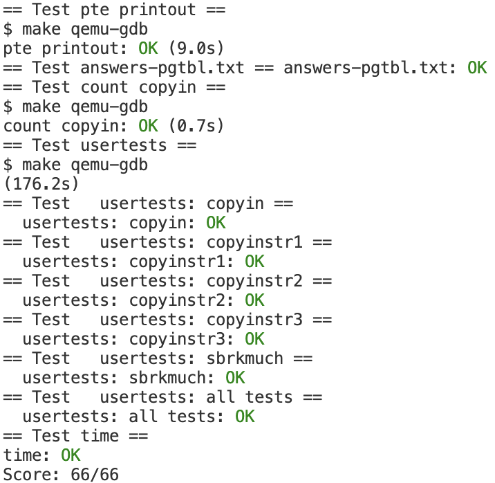

# Lab: page tables

距离上一次实验的文章发表已经过去了整整13天，快两周了😀，终于在前几天做完了第三个实验。鉴于[前一篇文章](../mit-6.s081-page-table-代码解析)写的太长了，已经对相关的我看过的代码进行了*（深入的）*解析...😤，故这篇文章简单罗列一下我的做法就象征性的结束啦。

这个实验的官方页面网址为: https://pdos.csail.mit.edu/6.828/2020/labs/pgtbl.html

## Print a page table

### 题目描述

> Define a function called `vmprint()`. It should take a `pagetable_t` argument, and print that pagetable in the format described below. Insert `if(p->pid==1) vmprint(p->pagetable)` in exec.c just before the `return argc`, to print the first process's page table. You receive full credit for this assignment if you pass the `pte printout` test of `make grade`.

> Now when you start xv6 it should print output like this, describing the page table of the first process at the point when it has just finished `exec()`ing `init`:
>
> ```text
> page table 0x0000000087f6e000
> ..0: pte 0x0000000021fda801 pa 0x0000000087f6a000
> .. ..0: pte 0x0000000021fda401 pa 0x0000000087f69000
> .. .. ..0: pte 0x0000000021fdac1f pa 0x0000000087f6b000
> .. .. ..1: pte 0x0000000021fda00f pa 0x0000000087f68000
> .. .. ..2: pte 0x0000000021fd9c1f pa 0x0000000087f67000
> ..255: pte 0x0000000021fdb401 pa 0x0000000087f6d000
> .. ..511: pte 0x0000000021fdb001 pa 0x0000000087f6c000
> .. .. ..510: pte 0x0000000021fdd807 pa 0x0000000087f76000
> .. .. ..511: pte 0x0000000020001c0b pa 0x0000000080007000
> ```

> The first line displays the argument to `vmprint`. After that there is a line for each PTE, including PTEs that refer to page-table pages deeper in the tree. Each PTE line is indented by a number of `" .."` that indicates its depth in the tree. Each PTE line shows the PTE index in its page-table page, the pte bits, and the physical address extracted from the PTE. Don't print PTEs that are not valid. In the above example, the top-level page-table page has mappings for entries 0 and 255. The next level down for entry 0 has only index 0 mapped, and the bottom-level for that index 0 has entries 0, 1, and 2 mapped.

### 做法

在官网上给出的提示粘贴如下

> Some hints:
>
> - You can put `vmprint()` in `kernel/vm.c`.
> - Use the macros at the end of the file kernel/riscv.h.
> - The function `freewalk` may be inspirational.
> - Define the prototype for `vmprint` in kernel/defs.h so that you can call it from exec.c.
> - Use `%p` in your printf calls to print out full 64-bit hex PTEs and addresses as shown in the example.

这个题，无非用递归的方式打印每一级页表就完事了，话不多说，直接上实现代码，在`vm.c`中`vmprint`函数实现如下

```c
/*
* a helper function to print page table recursively
* level is the level of pagetable
* 0 is the highest level
* 2 is the lowest level
*/
static void print_pte(pagetable_t pt,int level){
  if(level > 2)
    return;
  pte_t *pte = (pte_t *)pt;
  while(pte - (pte_t *)pt < 512){ // 512 pte in a page
    if(*pte & PTE_V){ // available entry
      for(int i = 0;i < level;i ++)
        printf(".. ");  // indent

      printf("..%d: pte %p pa %p\n",pte - (pte_t*)pt,*pte,PTE2PA(*pte));
      
      print_pte((pagetable_t)PTE2PA(*pte),level + 1);
    }
    pte ++; // next pte
  }
}

/*
* print the content of a pagetable
* this is a task for pagetable lab
*/
void vmprint(pagetable_t pt){
  printf("page table %p\n",pt);
  print_pte(pt,0);
}
```

实现完该函数后，在`exec`最后，当进程`pid`为1则打印那个进程的`pagetable`，在`exec`函数添加代码如下

```c
int
exec(char *path, char **argv)
{
  ...
  if(p->pid==1) vmprint(p->pagetable); // this line is for pagetable lab
  return argc; // this ends up in a0, the first argument to main(argc, argv)
	...
}
```

至此第一个task圆满完成。

---

## A kernel page table per process

### 题目描述

在xv6原来的代码实现中，内核就使用固定的一个`page table`，即[上一篇文章](../mit-6.s081-page-table-代码解析/#内核地址空间初始化)中讲到的`kernel_pagetable`，在这个task中需要给每一个进程都使用一个独立的`kernel page table`，这些`page table`中的大部分映射均和`kernel_pagetable`一致，题目描述摘抄如下

> Your first job is to modify the kernel so that every process uses its own copy of the kernel page table when executing in the kernel. Modify `struct proc` to maintain a kernel page table for each process, and modify the scheduler to switch kernel page tables when switching processes. For this step, each per-process kernel page table should be identical to the existing global kernel page table. You pass this part of the lab if `usertests` runs correctly.

### 做法

该task给了一些提示，如下

> Some hints:
>
> - Add a field to `struct proc` for the process's kernel page table.
> - A reasonable way to produce a kernel page table for a new process is to implement a modified version of `kvminit` that makes a new page table instead of modifying `kernel_pagetable`. You'll want to call this function from `allocproc`.
> - Make sure that each process's kernel page table has a mapping for that process's kernel stack. In unmodified xv6, all the kernel stacks are set up in `procinit`. You will need to move some or all of this functionality to `allocproc`.
> - Modify `scheduler()` to load the process's kernel page table into the core's `satp` register (see `kvminithart` for inspiration). Don't forget to call `sfence_vma()` after calling `w_satp()`.
> - `scheduler()` should use `kernel_pagetable` when no process is running.
> - Free a process's kernel page table in `freeproc`.
> - You'll need a way to free a page table without also freeing the leaf physical memory pages.
> - `vmprint` may come in handy to debug page tables.
> - It's OK to modify xv6 functions or add new functions; you'll probably need to do this in at least `kernel/vm.c` and `kernel/proc.c`. (But, don't modify `kernel/vmcopyin.c`, `kernel/stats.c`, `user/usertests.c`, and `user/stats.c`.)
> - A missing page table mapping will likely cause the kernel to encounter a page fault. It will print an error that includes `sepc=0x00000000XXXXXXXX`. You can find out where the fault occurred by searching for `XXXXXXXX` in `kernel/kernel.asm`.

要完成这个任务就跟着提示一步步做基本就行。

首先在进程结构中添加一项内核页表项，如下

```c
// Per-process state
struct proc {
  ...
  // per-process page table
  pagetable_t kernel_pgtb;
};
```

由于每个进程都要创建一个内核页表，故模仿`kvminit`函数写一个创建内核页表的函数，如下

```c
/*
* this is a helper function that maps pages.
* a helper function for make_kernel_ptbl
*/
void
map_helper(pagetable_t pt, uint64 va, uint64 pa, uint64 sz, int perm)
{
  if(mappages(pt, va, sz, pa, perm) != 0)
    panic("map_helper");
}

/* 
* make a page table that is identical to kernel_pagetable
* this function is used for make a copy of kernel page table
* for each process.
*/
pagetable_t make_kernel_ptbl(){
  pagetable_t pt = (pagetable_t) kalloc();
  memset(pt, 0, PGSIZE);

  // uart registers
  map_helper(pt,UART0, UART0, PGSIZE, PTE_R | PTE_W);

  // virtio mmio disk interface
  map_helper(pt,VIRTIO0, VIRTIO0, PGSIZE, PTE_R | PTE_W);

  // CLINT
  map_helper(pt,CLINT, CLINT, 0x10000, PTE_R | PTE_W);

  // PLIC
  map_helper(pt,PLIC, PLIC, 0x400000, PTE_R | PTE_W);

  // map kernel text executable and read-only.
  map_helper(pt,KERNBASE, KERNBASE, (uint64)etext-KERNBASE, PTE_R | PTE_X);

  // map kernel data and the physical RAM we'll make use of.
  map_helper(pt,(uint64)etext, (uint64)etext, PHYSTOP-(uint64)etext, PTE_R | PTE_W);

  // map the trampoline for trap entry/exit to
  // the highest virtual address in the kernel.
  map_helper(pt,TRAMPOLINE, (uint64)trampoline, PGSIZE, PTE_R | PTE_X);

  return pt;
}
```

该函数基本就是防着`kvminit`，构造了一份和`kernel_pagetable`一样的内核页表.

接着需要在所有创建进程的地方创建一份内核页表存入对应的`struct proc`结构中，上[一篇文章](../mit-6.s081-page-table-代码解析/#创建进程)提到，类UNIX系统中所有的进程都是通过`fork()`创建出来的（第一个进程是例外，因为此时还没有进程可以进行`fork`操作，所以第一个进程在`userinit`由系统构造），而`fork`用到了`allocproc`函数分配一个`UNUSED`的`struct proc`并进行了一些初始化，故在`allocproc`函数中添加创建内核页表相关代码，修改如下

```c
// Look in the process table for an UNUSED proc.
// If found, initialize state required to run in the kernel,
// and return with p->lock held.
// If there are no free procs, or a memory allocation fails, return 0.
static struct proc*
allocproc(void)
{
  struct proc *p;

  for(p = proc; p < &proc[NPROC]; p++) {
    acquire(&p->lock);
    if(p->state == UNUSED) {
      goto found;
    } else {
      release(&p->lock);
    }
  }
  return 0;

found:
  p->pid = allocpid();  // next pid not been used

  // Allocate a trapframe page.
  if((p->trapframe = (struct trapframe *)kalloc()) == 0){ // in kernel space, kalloc returns a physical address. so p->trapframe is a physical address
    release(&p->lock);
    return 0;
  }

  // An empty user page table.
  p->pagetable = proc_pagetable(p); // this return a page table that has trampoline and trapframe pages mapped
  if(p->pagetable == 0){
    freeproc(p);
    release(&p->lock);
    return 0;
  }

  // 此处添加一句创建内核页表的代码
  p->kernel_pgtb = make_kernel_ptbl(); // a kernel page table per process
	...
  return p;
}
```

根据提示，原先的实现中，所有的`kernel_stack`均在`procinit`中给所有进程分配好了，相关映射全都放在了全局的那个`kernel_pagetable`中，作为改进，应该将分配内核栈这一步骤从`procinit`移出来，放入`allocproc`中，内核栈的映射应放到每个进程自己的内核页表中，而不是全局的内核页表`kernel_pagetable`。

首先修改`procinit`，如下

```c
// initialize the proc table at boot time.
void
procinit(void)
{
  struct proc *p;
  
  initlock(&pid_lock, "nextpid");
  for(p = proc; p < &proc[NPROC]; p++) {
      initlock(&p->lock, "proc");

      // // Allocate a page for the process's kernel stack.
      // // Map it high in memory, followed by an invalid
      // // guard page.
      // char *pa = kalloc();
      // if(pa == 0)
      //   panic("kalloc");
      // uint64 va = KSTACK((int) (p - proc));
      // kvmmap(va, (uint64)pa, PGSIZE, PTE_R | PTE_W);
      // p->kstack = va;
      // above code set up kernel stack
      // in the lab: page table per process, we move this part to allocproc()
  }
  kvminithart();
}
```

将`kstack`相关代码全部注释掉，接着在`allocproc`中添加如下代码

```c
// Look in the process table for an UNUSED proc.
// If found, initialize state required to run in the kernel,
// and return with p->lock held.
// If there are no free procs, or a memory allocation fails, return 0.
static struct proc*
allocproc(void)
{
  ...
  p->kernel_pgtb = make_kernel_ptbl(); // a kernel page table per process

  // set up kstack
  char *pa = kalloc();
  if(pa == 0)
    panic("kalloc");
  // 一下代码给进程分配内核栈
  uint64 va = KSTACK((int) (p - proc)); 
  map_helper(p->kernel_pgtb,va, (uint64)pa, PGSIZE, PTE_R | PTE_W);
  p->kstack = va;
	...
  return p;
}
```

至此`allocproc`修改完毕。

---

按照提示，接着就应该修改调度器`scheduler`了，在将`cpu`转交给用户进程前先将`satp`改为对应的用户内核页表，没有进程运行时改回`kernel_pagetable`，修改`scheduler`如下

```c
// Per-CPU process scheduler.
// Each CPU calls scheduler() after setting itself up.
// Scheduler never returns.  It loops, doing:
//  - choose a process to run.
//  - swtch to start running that process.
//  - eventually that process transfers control
//    via swtch back to the scheduler.
void
scheduler(void)
{
  ...
 	// load process's kernel page table
  // so that when a process trap in the kernel, the loaded page table here
  // will be used (I guess... I haven't read the code about how process trap in kernel and I don't know how to return to process from kernel)
  w_satp(MAKE_SATP(p->kernel_pgtb));
  sfence_vma();
  swtch(&c->context, &p->context);
  // back to kernel, should use kernel_pagetable
  kvminithart(); 
  ...
}
```

如上，在`swtch`前后添加代码。

---

接着照着提示，在释放一个进程的资源时应当把对应内核页表占用的资源也释放掉，释放进程资源代码见`freeprocess`，如下

```c
// free a proc structure and the data hanging from it,
// including user pages.
// p->lock must be held.
static void
freeproc(struct proc *p)
{
  if(p->trapframe)
    kfree((void*)p->trapframe);
  p->trapframe = 0;
  if(p->pagetable)
    proc_freepagetable(p->pagetable, p->sz);
  p->pagetable = 0;
  p->sz = 0;
  p->pid = 0;
  p->parent = 0;
  p->name[0] = 0;
  p->chan = 0;
  p->killed = 0;
  p->xstate = 0;
  p->state = UNUSED;
}
```

添加一个释放内核页表占据空间的函数如下

```c
void proc_freekernel_pgtb(pagetable_t pagetable,int level){
  if(level > 2)
    return;

  // there are 2^9 = 512 PTEs in a page table.
  for(int i = 0; i < 512; i++){
    pte_t pte = pagetable[i];
    if(pte & PTE_V){
      // this PTE points to a lower-level page table.
      uint64 child = PTE2PA(pte);
      proc_freekernel_pgtb((pagetable_t)child,level + 1);
      pagetable[i] = 0;
    }
  }
  kfree((void*)pagetable);
}
```

该函数递归的释放页表所在页，将其放回`freelist`中，但注意该函数只释放页表占据的空间，而不会释放页表映射到的物理内存。*如果释放了对应物理内存，那直接寄了，映射到的所有物理页都会放一个`struct run`结构，破坏了原有数据，且所有这些地址都可能会被`kalloc`分配在别的地方使用，这些地址都放着不应该动的数据或者其他IO设备*。

接着修改`freeproc`函数如下，最初我修改的版本如下

```c
// free a proc structure and the data hanging from it,
// including user pages.
// p->lock must be held.
static void
freeproc(struct proc *p)
{
  if(p->trapframe)
    kfree((void*)p->trapframe);
  p->trapframe = 0;
  if(p->pagetable)
    proc_freepagetable(p->pagetable, p->sz);
  if(p->kernel_pgtb) // 添加的代码
    proc_freekernel_pgtb(p->kernel_pgtb,0);
  ...
}
```

但这样修改有一些测试无法通过......后来我在`sys_exec`中打印空闲物理页数目时发现，我每执行完一个进程，空闲物理页就少一页，说明还少释放了些什么东西😨，回头看`allocproc`时，记起来我不仅创建了内核页表，同时分配了一页空闲内存作为`kstack`，而这一页在释放资源时忘记回收了😇

最终版`freeproc`如下

```c
// free a proc structure and the data hanging from it,
// including user pages.
// p->lock must be held.
static void
freeproc(struct proc *p)
{
  ...
  uvmunmap(p->kernel_pgtb,p->kstack,1,1); // 用uvmunmap删除kstack的映射，do_free参数为1，同时释放对应物理页
  if(p->kernel_pgtb)
    proc_freekernel_pgtb(p->kernel_pgtb,0);
  ...
}
```

---

最后还有一个鬼地方官方提示没有提到的，做了以上的修改后会报一个`panic: kvmpa`，需要修改`kvmpa`函数，使用进程的内核页表

```c
// translate a kernel virtual address to
// a physical address. only needed for
// addresses on the stack.
// assumes va is page aligned.
uint64
kvmpa(uint64 va)
{
  uint64 off = va % PGSIZE;
  pte_t *pte;
  uint64 pa;

  struct proc*
    myproc(void);
  pte = walk(myproc()->kernel_pgtb , va, 0); // 这里本来第一个参数为 kernel_pagetable
  if(pte == 0)
    panic("kvmpa");
  if((*pte & PTE_V) == 0)
    panic("kvmpa");
  pa = PTE2PA(*pte);
  return pa+off;
}
```

可以肯定在某些地方，用户的内核页表会被修改的，和全局那个不一样(用户的内核页表应该是在用户陷入内核，即做系统调用时使用的)，此处使用用户的内核页表才能正常运行。

---

以上步骤均完成后，可以顺利通过该task的测试啦😁。

## Simplify `copyin/copyinstr`

在上一个实验中看到了，由于用户用的页表和内核使用的页表不一样，在做系统调用陷入内核后，内核要拿到用户提供的缓冲区的数据，必须要用`copyin`拿到用户的数据，`copyinstr`拿到用户提供的字符串，等等等等。`copyin`拿到用户数据的方法是:有了用户的`pagetable`可以使用`walk`得到用户数据所在的的`pa`，内核页表基本都是恒等映射，有了物理地址就可以取出用户数据。

从上面的描述可以看出，用户进行系统调用时，内核和用户交互数据很麻烦，因为使用的页表不一样。在上一个task中，我们给每一个进程都分配了一个内核页表，进程需要使用内核提供的功能时，陷入内核后使用的就是该进程对应的内核页表。那么，为了使内核可以和用户进程更方便的交互数据，其实可以将用户页表中的映射复制到对应的内核页表中，这样内核就可以直接通过用户提供的地址拿到或放入数据了。

当然在这里吗可能存在问题，通过[上一篇文章](../mit-6.s081-page-table-代码解析/)的诸多代码(如`userinit`创建第一个进程，`exec`创建新进程等等)都可以看出，用户的地址空间从0增长到`p->sz`(`p`为`struct proc`指针，指向该进程对应的结构体)，如果0~`p->sz`和内核页表原先映射的空间重叠，那就糟糕了。所幸的是，用户陷入到内核时，内核会使用到的地址空间的范围在`PLIC`以上，这之下的空间不会用到，故只要用户进程空间增长不超过`PLIC`，就不会有问题。

### 问题描述

> The kernel's `copyin` function reads memory pointed to by user pointers. It does this by translating them to physical addresses, which the kernel can directly dereference. It performs this translation by walking the process page-table in software. Your job in this part of the lab is to add user mappings to each process's kernel page table (created in the previous section) that allow `copyin` (and the related string function `copyinstr`) to directly dereference user pointers.
>
> > Replace the body of `copyin` in `kernel/vm.c` with a call to `copyin_new` (defined in `kernel/vmcopyin.c`); do the same for `copyinstr` and `copyinstr_new`. Add mappings for user addresses to each process's kernel page table so that `copyin_new` and `copyinstr_new` work. You pass this assignment if `usertests` runs correctly and all the `make grade` tests pass.
>
> Some hints:
>
> - Replace `copyin()` with a call to `copyin_new` first, and make it work, before moving on to `copyinstr`.
> - At each point where the kernel changes a process's user mappings, change the process's kernel page table in the same way. Such points include `fork()`, `exec()`, and `sbrk()`.
> - Don't forget that to include the first process's user page table in its kernel page table in `userinit`.
> - What permissions do the PTEs for user addresses need in a process's kernel page table? (A page with `PTE_U` set cannot be accessed in kernel mode.)
> - Don't forget about the above-mentioned PLIC limit.

### 做法

按照前面的描述，只需要在用户进程地址空间发生变化，并在用户页表做对应映射时，用户的内核页表也做同样的映射即可。

首先依据题目，可以知道用户进程的内核页表其实用不到`CLINT`，故修改`make_kernel_ptbl()`函数如下

```c
/* 
* make a page table that is identical to kernel_pagetable
* this function is used for making a copy of kernel page table
* for each process.
*/
pagetable_t make_kernel_ptbl(){
  pagetable_t pt = (pagetable_t) kalloc();
  memset(pt, 0, PGSIZE);

  // uart registers
  map_helper(pt,UART0, UART0, PGSIZE, PTE_R | PTE_W);

  // virtio mmio disk interface
  map_helper(pt,VIRTIO0, VIRTIO0, PGSIZE, PTE_R | PTE_W);

  // CLINT
  // map_helper(pt,CLINT, CLINT, 0x10000, PTE_R | PTE_W);

  // PLIC
  map_helper(pt,PLIC, PLIC, 0x400000, PTE_R | PTE_W);

  // map kernel text executable and read-only.
  map_helper(pt,KERNBASE, KERNBASE, (uint64)etext-KERNBASE, PTE_R | PTE_X);

  // map kernel data and the physical RAM we'll make use of.
  map_helper(pt,(uint64)etext, (uint64)etext, PHYSTOP-(uint64)etext, PTE_R | PTE_W);

  // map the trampoline for trap entry/exit to
  // the highest virtual address in the kernel.
  map_helper(pt,TRAMPOLINE, (uint64)trampoline, PGSIZE, PTE_R | PTE_X);
  return pt;
}
```

如上，将`CLINT`映射删去。

#### 辅助函数

按照前文所述，需要给内核页表同步做和用户页表一样的映射，故在`vm.c`中写一个复制两个页表映射的辅助函数如下

```c
// copy page table from src to dst
// virtual address from oldsz to newsz
int copy_pgtb(pagetable_t dst,pagetable_t src, uint64 oldsz, uint64 newsz){
  uint64 a = PGROUNDUP(oldsz); // oldsz那一页原本已经分配并映射过了，故此处是round up
  uint64 addr;
  pte_t *pte;
  for(; a < newsz; a += PGSIZE){
    if(a >= PLIC)  // 要超过PLIC了，不允许
      goto err;
    pte = walk(src,a,0); 
    if(!pte)
      goto err;
    addr = PTE2PA(*pte);  // 拿到映射到的物理地址
    if(mappages(dst,a,PGSIZE,addr,PTE_W | PTE_R) != 0) // 在dst中做同样的映射
      goto err;
  }
  return 1;
err:
  uvmunmap(dst,PGROUNDUP(oldsz),(a - PGROUNDUP(oldsz)) / PGSIZE,0); // 出错，去除已经做了的映射，恢复原样
  return 0;
}
```

上面这个函数是仿照`uvmalloc`来写的，作用是从`src`页表中将虚拟地址`oldsz`到`newsz`的映射复制到页表`dst`中去。上面这个代码是正确可用的，之前我曾写过下面这个版本

```c
// copy page table from src to dst
// virtual address from oldsz to newsz
int copy_pgtb(pagetable_t dst,pagetable_t src, uint64 oldsz, uint64 newsz){
  uint64 a = PGROUNDUP(oldsz); // oldsz那一页原本已经分配并映射过了，故此处是round up
  uint64 addr;
  pte_t *pte;
  for(; a < newsz; a += PGSIZE){
    if(a >= PLIC)  // 要超过PLIC了，不允许
      goto err;
    if((addr = walkaddr(src,a)) == 0)
      panic("copy_pgtb: addr in src not available");
    if(mappages(dst,a,PGSIZE,addr,PTE_W | PTE_R) != 0) // 在dst中做同样的映射
      goto err;
  }
  return 1;
err:
  uvmunmap(dst,PGROUNDUP(oldsz),(a - PGROUNDUP(oldsz)) / PGSIZE,0); // 出错，去除已经做了的映射，恢复原样
  return 0;
}
```

直接通过`walkaddr`拿到`va`对应的`pa`，但在实际运行时报了`panic`，`walkaddr`总是运行不正确，`walkaddr`代码如下

```c
// Look up a virtual address, return the physical address,
// or 0 if not mapped.
// Can only be used to look up user pages.
uint64
walkaddr(pagetable_t pagetable, uint64 va)
{
  pte_t *pte;
  uint64 pa;

  if(va >= MAXVA)
    return 0;

  pte = walk(pagetable, va, 0);
  if(pte == 0)
    return 0;
  if((*pte & PTE_V) == 0)
    return 0;
  if((*pte & PTE_U) == 0)
    return 0;
  pa = PTE2PA(*pte);
  return pa;
}
```

可以看到`walkaddr`只查`PTE_U`的`pte`，在[上一篇文章](../mit-6.s081-page-table-代码解析/#exec)中可以看到，用户栈前一页是`guard page`，这一页没有设置`PTE_U`，故在复制映射时走到`guard page`就会出错了，所以还得是直接用`walk`。

---

#### userinit

第一个进程在`userinit`处初始化，在该函数内同时复制用户页表到内核页表如下

```c
// Set up first user process.
void
userinit(void)
{
  struct proc *p;

  p = allocproc();  // set trampoline and trapframe
  initproc = p;
  
  // allocate one user page and copy init's instructions
  // and data into it.
  uvminit(p->pagetable, initcode, sizeof(initcode));  // allocate one page and copy data in it
  copy_pgtb(p->kernel_pgtb,p->pagetable,0,PGSIZE);    // <------添加这句话
  p->sz = PGSIZE;

  // prepare for the very first "return" from kernel to user.
  p->trapframe->epc = 0;      // user program counter
  p->trapframe->sp = PGSIZE;  // user stack pointer

  safestrcpy(p->name, "initcode", sizeof(p->name));
  p->cwd = namei("/");

  p->state = RUNNABLE;

  release(&p->lock);
}
```

#### fork

除去第一个进程，其余所有进程都是通过`fork`创建的，在该处也要同步页表，如下

```c
// Create a new process, copying the parent.
// Sets up child kernel stack to return as if from fork() system call.
int
fork(void)
{
  int i, pid;
  struct proc *np;
  struct proc *p = myproc();

  // Allocate process.
  if((np = allocproc()) == 0){
    return -1;
  }
	
  // 下面这一条if语句中除了复制父进程内存，同时也将子进程页表同步到子进程内核页表
  // Copy user memory from parent to child.
  if(uvmcopy(p->pagetable, np->pagetable, p->sz) < 0 || !copy_pgtb(np->kernel_pgtb,np->pagetable,0,p->sz)){//<--- 修改了这一行
    freeproc(np);
    release(&np->lock);
    return -1;
  }
  np->sz = p->sz;

  np->parent = p;

  // copy saved user registers.
  *(np->trapframe) = *(p->trapframe);

  // Cause fork to return 0 in the child.
  np->trapframe->a0 = 0;

  // increment reference counts on open file descriptors.
  for(i = 0; i < NOFILE; i++)
    if(p->ofile[i])
      np->ofile[i] = filedup(p->ofile[i]);
  np->cwd = idup(p->cwd);

  safestrcpy(np->name, p->name, sizeof(p->name));

  pid = np->pid;

  np->state = RUNNABLE;

  release(&np->lock);

  return pid;
}
```

#### exec

`exec`函数通过读取`elf`文件，重新创建新的内存地址空间，填入新的内容，删除原来的内存地址空间，对该函数做修改如下

```c
int
exec(char *path, char **argv)
{
  char *s, *last;
  int i, off;
  uint64 argc, sz = 0, sp, ustack[MAXARG+1], stackbase;
  struct elfhdr elf;
  struct inode *ip;
  struct proghdr ph;
  pagetable_t pagetable = 0, oldpagetable;
  struct proc *p = myproc();

  ... // 这里在读elf,创建新的页表，填入新的进程的各个段，并初始化命令行参数
    
  // Commit to the user image.
  oldpagetable = p->pagetable;
  p->pagetable = pagetable;
  p->sz = sz;
  p->trapframe->epc = elf.entry;  // initial program counter = main
  p->trapframe->sp = sp; // initial stack pointer
  uvmunmap(p->kernel_pgtb,0,PGROUNDUP(oldsz)/PGSIZE,0); // <-------去除原来的映射
  proc_freepagetable(oldpagetable, oldsz); // 回收原来的空间
  if(!copy_pgtb(p->kernel_pgtb,p->pagetable,0,p->sz))  // <-----同步内核页表
    goto bad;
  
  if(p->pid==1) vmprint(p->pagetable); // this line is for pagetable lab
  return argc; // this ends up in a0, the first argument to main(argc, argv)

bad:
 ... // 后面在做错误处理
}
```

#### sbrk

`sbrk`系统调用会改变进程可用内存空间大小，可以增加内存也可以减小内存，因此也会改变用户页表，故内核页表也要做对应改变。查看该系统调用代码如下

```c
uint64
sys_sbrk(void)
{
  int addr;
  int n;

  if(argint(0, &n) < 0)
    return -1;
  addr = myproc()->sz;
  if(growproc(n) < 0)
    return -1;
  return addr;
}
```

可以看到`growproc`完成了改变内存大小的工作，修改该函数如下

```c
// Grow or shrink user memory by n bytes.
// Return 0 on success, -1 on failure.
int
growproc(int n)
{
  uint sz;
  struct proc *p = myproc();

  sz = p->sz;
  if(n > 0){
    if((sz = uvmalloc(p->pagetable, sz, sz + n)) == 0) {
      return -1;
    }
    if(!copy_pgtb(p->kernel_pgtb,p->pagetable,p->sz,sz)){// <---同步增长 
      return -1;
    }
  } else if(n < 0){
    // 下面这俩写反了........
    uvmunmap(p->kernel_pgtb,PGROUNDUP(sz+n),(PGROUNDUP(sz) - PGROUNDUP(sz+n)) / PGSIZE,0); //<---- 同步减少
    sz = uvmdealloc(p->pagetable, sz, sz + n);
  }
  p->sz = sz;
  return 0;
}
```

##### 插曲

额，之前写上面那个`growproc`的代码时，`uvmunmap`和`uvmdealloc`那两行写反了，导致代码会报`panic: not map`，查找`uvmunmap`时发现报`panic`的代码如下

```c
// Remove npages of mappings starting from va. va must be
// page-aligned. The mappings must exist.
// Optionally free the physical memory.
void
uvmunmap(pagetable_t pagetable, uint64 va, uint64 npages, int do_free)
{
  uint64 a;
  pte_t *pte;

  if((va % PGSIZE) != 0)
    panic("uvmunmap: not aligned");

  for(a = va; a < va + npages*PGSIZE; a += PGSIZE){
    if((pte = walk(pagetable, a, 0)) == 0)
      panic("uvmunmap: walk");
    if((*pte & PTE_V) == 0)
      panic("uvmunmap: not mapped"); // <---- 这里，如果一页映射不存在，就会报这个panic
    if(PTE_FLAGS(*pte) == PTE_V)
      panic("uvmunmap: not a leaf");
    if(do_free){
      uint64 pa = PTE2PA(*pte);
      kfree((void*)pa);
    }
    *pte = 0;
  }
}
```

使用`gdb`在`panic`处设置断点，跑到`panic`了后使用`backtrace`查看栈帧，发现是在`exec`中如下代码爆出的错误

```c
// Commit to the user image.
  oldpagetable = p->pagetable;
  p->pagetable = pagetable;
  p->sz = sz;
  p->trapframe->epc = elf.entry;  // initial program counter = main
  p->trapframe->sp = sp; // initial stack pointer
  uvmunmap(p->kernel_pgtb,0,PGROUNDUP(oldsz)/PGSIZE,0); // <------- 这一个uvmunmap报了panic
  proc_freepagetable(oldpagetable, oldsz); // 回收原来的空间
  if(!copy_pgtb(p->kernel_pgtb,p->pagetable,0,p->sz))  // <-----同步内核页表
    goto bad;
```

感觉在`growproc`那的两行代码的顺序没问题呀，一个是删除用户的页表中对应地址的映射并释放对应空间，一个是删除内核页表对应地址的映射，好像什么顺序都行呀。

然后我写了下面的函数来`debug`，下面的函数用于查看某个页表从0开始映射的有效页数

```c
int num_user_pages(pagetable_t pt){
  int num = 0;
  uint64 a = 0;
  pte_t *pte;
  while(a < PLIC){
    pte = walk(pt,a,0);
    if(!pte || !(*pte & PTE_V))
      break;
    num ++;
    a += PGSIZE;
  }
  return num;
}
```

接着修改`growproc`代码

```c
int
growproc(int n)
{
  uint sz;
  struct proc *p = myproc();

  sz = p->sz;
  if(n > 0){
    if((sz = uvmalloc(p->pagetable, sz, sz + n)) == 0) {
      return -1;
    }
    if(!copy_pgtb(p->kernel_pgtb,p->pagetable,p->sz,sz)){
      return -1;
    }
  } else if(n < 0){
    sz = uvmdealloc(p->pagetable, sz, sz + n);
    printf("right before uvmunmap in growproc\n");
    uvmunmap(p->kernel_pgtb,PGROUNDUP(sz+n),(PGROUNDUP(sz) - PGROUNDUP(sz+n)) / PGSIZE,0);
    printf("right after uvmunmap in growproc\n\n");
  }

  printf(">>>>growproc done. pid = %d\n",p->pid);
  printf("--- user pgtbl:%d\n--- kernel pgtbl:%d\n\n",num_user_pages(p->pagetable),num_user_pages(p->kernel_pgtb));

  p->sz = sz;
  return 0;
}
```

运行`usertests`时发现有这样的输出

```text
...
right before uvmunmap in growproc
right after uvmunmap in growproc

>>>>growproc done. pid = 20
--- user pgtbl:32082
--- kernel pgtbl:32081

right before uvmunmap in growproc
right after uvmunmap in growproc

>>>>growproc done. pid = 20
--- user pgtbl:32081
--- kernel pgtbl:32080
...
```

震惊，在`growproc`用于减小内存空间时`kernel pagetbl`少了一页，怎么肥事，再仔细看看

```c
sz = uvmdealloc(p->pagetable, sz, sz + n);
uvmunmap(p->kernel_pgtb,PGROUNDUP(sz+n),(PGROUNDUP(sz) - PGROUNDUP(sz+n)) / PGSIZE,0);
```

原来前面的`sz = uvmdealloc(...)`已经改变了`sz`的大小😇，后面`uvmunmap`用的`sz`是错的......

所以这两句换过来后`sz`就对了，就能通过所有测试了。

---

#### `copyin/copyinstr`

修改原来的`copyin/copyinstr`这两个函数如下

```c
// Copy a null-terminated string from user to kernel.
// Copy bytes to dst from virtual address srcva in a given page table,
// until a '\0', or max.
// Return 0 on success, -1 on error.
int
copyinstr(pagetable_t pagetable, char *dst, uint64 srcva, uint64 max)
{
  int copyinstr_new(pagetable_t pagetable, char *dst, uint64 srcva, uint64 max);
  return copyinstr_new(pagetable,dst,srcva,max);
}

// Copy from user to kernel.
// Copy len bytes to dst from virtual address srcva in a given page table.
// Return 0 on success, -1 on error.
int
copyin(pagetable_t pagetable, char *dst, uint64 srcva, uint64 len)
{
  int copyin_new(pagetable_t pagetable, char *dst, uint64 srcva, uint64 len);
  return copyin_new(pagetable, dst, srcva, len);
}
```

其中`copyin_new`和`copyinstr`是这个实验本来就已经实现好了的，其实就是简单的直接复制数据，截取`copyin_new`代码如下

```c
void*
memmove(void *dst, const void *src, uint n)
{
  const char *s;
  char *d;

  s = src;
  d = dst;
  if(s < d && s + n > d){
    s += n;
    d += n;
    while(n-- > 0)
      *--d = *--s;
  } else
    while(n-- > 0)
      *d++ = *s++;

  return dst;
}

copyin_new(pagetable_t pagetable, char *dst, uint64 srcva, uint64 len)
{
  struct proc *p = myproc();

  if (srcva >= p->sz || srcva+len >= p->sz || srcva+len < srcva)
    return -1;
  memmove((void *) dst, (void *)srcva, len); // 直接复制数据
  stats.ncopyin++;   // XXX lock  // 这貌似是测试用的代码？
  return 0;
}
```

---

## 尾声

做完上面的所有修改，就可以通过所有的测试啦😋😋

上个图纪念一下



做完这个实验，也算是实际使用过了传说中的页表啦，虽然整体使用页表的方式都比较简单，但毕竟是一个真正的跑在riscv上的东西，和纯理论相比实际多了，还算是有所收获😁。
