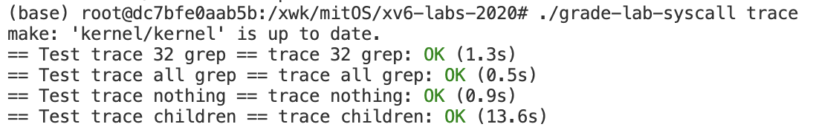

# OS lab syscall

时隔一天，居然又象征性的完成了一个实验😋

本次实验需要在xv6系统内额外添加两个系统调用，分别是`trace`和`sysinfo`，`trace`用于跟踪某个进程使用系统调用的情况，`sysinfo`用于查看系统内空闲内存和进程个数。

实验的官方指导见 https://pdos.csail.mit.edu/6.828/2020/labs/syscall.html 。

## 准备

官方[指导](https://pdos.csail.mit.edu/6.828/2020/labs/syscall.html)中的前置要求是

> Before you start coding, read Chapter 2 of the [xv6 book](https://pdos.csail.mit.edu/6.828/2020/xv6/book-riscv-rev1.pdf), and Sections 4.3 and 4.4 of Chapter 4, and related source files:
>
> - The user-space code for systems calls is in `user/user.h` and `user/usys.pl`.
> - The kernel-space code is `kernel/syscall.h`, `kernel/syscall.c`.
> - The process-related code is `kernel/proc.h` and `kernel/proc.c`.

指导书中的Chapter 2描述了操作系统的组织结构，内容大概是简单讲了一下操作系统的功能作用、操作系统为什么重要、有哪些组织操作系统各个部分的方法等等。

在Chapter 2的最后大概讲了讲xv6的启动过程。

### 启动流程概述

qemu模拟的机器启动时首先执行ROM中的程序，这个程序的作用应该就是将启动区的一部分代码载入内存并转交CPU使用权到载入的代码，xv6最初的代码见`kernel/entry.S:6`

```assembly
				# qemu -kernel loads the kernel at 0x80000000
        # and causes each CPU to jump there.
        # kernel.ld causes the following code to
        # be placed at 0x80000000.
.section .text
_entry:
				# set up a stack for C.
        # stack0 is declared in start.c,
        # with a 4096-byte stack per CPU.
        # sp = stack0 + (hartid * 4096)
        la sp, stack0
        li a0, 1024*4
				csrr a1, mhartid
        addi a1, a1, 1
        mul a0, a0, a1
        add sp, sp, a0
				# jump to start() in start.c
        call start
spin:
        j spin
```

上面的汇编代码设置好栈顶寄存器后将跳转到 `kernel/start.c`中的`start`函数，注意在机器刚启动时处在`machine mode`，该模式下拥有所有的权限。

```c
// entry.S jumps here in machine mode on stack0.
void
start()
{
  // set M Previous Privilege mode to Supervisor, for mret.
  unsigned long x = r_mstatus();
  x &= ~MSTATUS_MPP_MASK;
  x |= MSTATUS_MPP_S;
  w_mstatus(x);

  // set M Exception Program Counter to main, for mret.
  // requires gcc -mcmodel=medany
  w_mepc((uint64)main);

  // disable paging for now.
  w_satp(0);

  // delegate all interrupts and exceptions to supervisor mode.
  w_medeleg(0xffff);
  w_mideleg(0xffff);
  w_sie(r_sie() | SIE_SEIE | SIE_STIE | SIE_SSIE);

  // ask for clock interrupts.
  timerinit();

  // keep each CPU's hartid in its tp register, for cpuid().
  int id = r_mhartid();
  w_tp(id);

  // switch to supervisor mode and jump to main().
  asm volatile("mret");
}
```

上面的代码对机器进行了一些设置，没了解过riscv的处理器，随着实验的深入应该也许会了解更多吧，上面代码的最后一句，使用汇编`mret`，这一般用于`supervisor mode`调用`machine mode`的代码后从`machine mode`返回`supervisor mode`，在这个代码里通过`mret`进入`supervisor mode`，也就是操作系统内核运行的模式，在`start`函数前面一些代码已经将返回地址设为了`main`，故`mret`会转到`main`函数。

```c
// start() jumps here in supervisor mode on all CPUs.
void
main()
{
  if(cpuid() == 0){
    consoleinit();
    printfinit();
    printf("\n");
    printf("xv6 kernel is booting\n");
    printf("\n");
    kinit();         // physical page allocator
    kvminit();       // create kernel page table
    kvminithart();   // turn on paging
    procinit();      // process table
    trapinit();      // trap vectors
    trapinithart();  // install kernel trap vector
    plicinit();      // set up interrupt controller
    plicinithart();  // ask PLIC for device interrupts
    binit();         // buffer cache
    iinit();         // inode cache
    fileinit();      // file table
    virtio_disk_init(); // emulated hard disk
    userinit();      // first user process
    __sync_synchronize();
    started = 1;
  } else {
    while(started == 0)
      ;
    __sync_synchronize();
    printf("hart %d starting\n", cpuid());
    kvminithart();    // turn on paging
    trapinithart();   // install kernel trap vector
    plicinithart();   // ask PLIC for device interrupts
  }

  scheduler();        
}
```

`main`函数内进行了一堆初始化操作，最后调用了`userinit()`函数启动第一个用户进程，该函数代码如下

```c
// Set up first user process.
void
userinit(void)
{
  struct proc *p;

  p = allocproc();
  initproc = p;
  
  // allocate one user page and copy init's instructions
  // and data into it.
  uvminit(p->pagetable, initcode, sizeof(initcode));
  p->sz = PGSIZE;

  // prepare for the very first "return" from kernel to user.
  p->trapframe->epc = 0;      // user program counter
  p->trapframe->sp = PGSIZE;  // user stack pointer

  safestrcpy(p->name, "initcode", sizeof(p->name));
  p->cwd = namei("/");

  p->state = RUNNABLE;

  release(&p->lock);
}
```

上面的代码在对进程一些必要的东西初始化后启动了`initcode`这一个用户进程，该进程是用汇编写的，代码如下

```assembly
#include "syscall.h"

# exec(init, argv)
.globl start
start:
        la a0, init
        la a1, argv
        li a7, SYS_exec
        ecall

# for(;;) exit();
exit:
        li a7, SYS_exit
        ecall
        jal exit

# char init[] = "/init\0";
init:
  .string "/init\0"

# char *argv[] = { init, 0 };
.p2align 2
argv:
  .long init
  .long 0
```

上面的代码相当于执行了c程序

```c
void start(){
  char *init = "/init";
  char *argv[] = {init,0};
  
  exec(init,argv);
  for(;;)
    exit();
}
```

这个`/init`程序见源码`user/init.c`

```c
// init: The initial user-level program

#include "kernel/types.h"
#include "kernel/stat.h"
#include "kernel/spinlock.h"
#include "kernel/sleeplock.h"
#include "kernel/fs.h"
#include "kernel/file.h"
#include "user/user.h"
#include "kernel/fcntl.h"

char *argv[] = { "sh", 0 };

int
main(void)
{
  int pid, wpid;

  if(open("console", O_RDWR) < 0){
    mknod("console", CONSOLE, 0);
    open("console", O_RDWR);
  }
  dup(0);  // stdout
  dup(0);  // stderr

  for(;;){
    printf("init: starting sh\n");
    pid = fork();
    if(pid < 0){
      printf("init: fork failed\n");
      exit(1);
    }
    if(pid == 0){
      exec("sh", argv);
      printf("init: exec sh failed\n");
      exit(1);
    }

    for(;;){
      // this call to wait() returns if the shell exits,
      // or if a parentless process exits.
      wpid = wait((int *) 0);
      if(wpid == pid){
        // the shell exited; restart it.
        break;
      } else if(wpid < 0){
        printf("init: wait returned an error\n");
        exit(1);
      } else {
        // it was a parentless process; do nothing.
      }
    }
  }
}
```

引用指导书的话，`init`程序干的事为

> Init (user/init.c:15) creates a new console device fifile if needed and then opens it as fifile descriptors 0, 1, and 2. Then it starts a shell on the console. The system is up.

xv6大致的启动流程到此结束，其实还是比较模糊的，细节应该会在后面的实验逐渐展开  ...   吧🤣

---

### 系统调用

在实验指导[网站](https://pdos.csail.mit.edu/6.828/2020/labs/syscall.html)中还提到要看指导书的4.3和4.4节，这两节象征性的讲了下系统调用相关的代码，细节不表，大概流程在本节粗略的解释一下。

首先在上一节中其实看到了汇编如何调用exec系统调用的，如下

```assembly
la a0, init
la a1, argv
li a7, SYS_exec
ecall
```

riscv内有a0-a7这几个寄存器（按照惯例）用于传递参数(a就是arg)，exec需要两个参数，这两个参数分别存入a0,a1中，a7用于存放系统调用号。ecall指令会陷入内核(具体哪里以后应该会知道的)，陷入内核后依次执行`uservec`、`usertrap`然后是`syscall`，最后这个`syscall`函数真正调用了系统调用。该函数见`kernel/syscall.c`

```c
void
syscall(void)
{
  int num;
  struct proc *p = myproc();

  num = p->trapframe->a7;
  if(num > 0 && num < NELEM(syscalls) && syscalls[num]) {
    p->trapframe->a0 = syscalls[num]();
  } else {
    printf("%d %s: unknown sys call %d\n",
            p->pid, p->name, num);
    p->trapframe->a0 = -1;
  }
}
```

先注意上面的`myproc`，该函数返回一个进程(使用系统调用的进程)相关的结构体(应该就是理论学习中的PCB了吧)，该结构体定义如下

```c
// Per-process state
struct proc {
  struct spinlock lock;

  // p->lock must be held when using these:
  enum procstate state;        // Process state
  struct proc *parent;         // Parent process
  void *chan;                  // If non-zero, sleeping on chan
  int killed;                  // If non-zero, have been killed
  int xstate;                  // Exit status to be returned to parent's wait
  int pid;                     // Process ID

  // these are private to the process, so p->lock need not be held.
  uint64 kstack;               // Virtual address of kernel stack
  uint64 sz;                   // Size of process memory (bytes)
  pagetable_t pagetable;       // User page table
  struct trapframe *trapframe; // data page for trampoline.S
  struct context context;      // swtch() here to run process
  struct file *ofile[NOFILE];  // Open files
  struct inode *cwd;           // Current directory
  char name[16];               // Process name (debugging)
};
```

上面结构中的`trapframe`存着该进程的寄存器状态和其他一些信息，在回过头来看`syscall`中的如下代码

```c
int num;
struct proc *p = myproc();

num = p->trapframe->a7;  // a7存的是调用号，如前面汇编语言调用系统调用所示
if(num > 0 && num < NELEM(syscalls) && syscalls[num]) { // 调用号满足一定条件才能调用系统调用
  p->trapframe->a0 = syscalls[num]();
}
```

解释见注释，再来看看`syscalls`这个变量

```c
static uint64 (*syscalls[])(void) = {
[SYS_fork]    sys_fork,
[SYS_exit]    sys_exit,
[SYS_wait]    sys_wait,
[SYS_pipe]    sys_pipe,
[SYS_read]    sys_read,
[SYS_kill]    sys_kill,
[SYS_exec]    sys_exec,
[SYS_fstat]   sys_fstat,
[SYS_chdir]   sys_chdir,
[SYS_dup]     sys_dup,
[SYS_getpid]  sys_getpid,
[SYS_sbrk]    sys_sbrk,
[SYS_sleep]   sys_sleep,
[SYS_uptime]  sys_uptime,
[SYS_open]    sys_open,
[SYS_write]   sys_write,
[SYS_mknod]   sys_mknod,
[SYS_unlink]  sys_unlink,
[SYS_link]    sys_link,
[SYS_mkdir]   sys_mkdir,
[SYS_close]   sys_close,
};
```

这是一个指向函数的指针的数组，指向的函数形如`uint64 func_name(void )`，这一段代码给该数组进行初始化，其中`sys_fork`，`sys_exit`之类的为具体的函数(函数就是一堆指令，函数名其实就是这一堆指令的首地址)，`SYS_fork`之类的表明数组下标，这些宏定义在`syscall.h`

```c
// System call numbers
#define SYS_fork    1
#define SYS_exit    2
#define SYS_wait    3
#define SYS_pipe    4
#define SYS_read    5
#define SYS_kill    6
#define SYS_exec    7
#define SYS_fstat   8
#define SYS_chdir   9
#define SYS_dup    10
#define SYS_getpid 11
#define SYS_sbrk   12
#define SYS_sleep  13
#define SYS_uptime 14
#define SYS_open   15
#define SYS_write  16
#define SYS_mknod  17
#define SYS_unlink 18
#define SYS_link   19
#define SYS_mkdir  20
#define SYS_close  21
```

---

### 获取参数

上面看到了系统调用的过程，`syscall`实际上是根据`a7`中的调用号来选择某个具体的实现系统调用的函数来完成系统调用的。上一小节看到，`syscall`调用的函数原型为`uint64 func_name(void)`，那这些函数如何拿到用户传递的参数呢？

实际上通过陷入系统调用的代码就可以看出来了

```assembly
# 调用 exec(init,argv)
la a0, init
la a1, argv
li a7, SYS_exec
ecall
```

参数存在了该进程的a0-a5寄存器中，而通过前文可以看到，可以通过`myproc`拿到用户进程的`PCB`，也就是一个`struct proc *`，该结构内的`trapframe`内有用户进程的寄存器状态，比如`exec`要拿到第一个参数，只需要拿到a0即可，如下

```c
struct proc *p = myproc();

p->trapframe->a0  //  这个值就是第一个参数
```

在`kernel/syscall.c`中已经给我们封装好了相关的函数，如下

```c
static uint64
argraw(int n)
{
  struct proc *p = myproc();
  switch (n) {
  case 0:
    return p->trapframe->a0;
  case 1:
    return p->trapframe->a1;
  case 2:
    return p->trapframe->a2;
  case 3:
    return p->trapframe->a3;
  case 4:
    return p->trapframe->a4;
  case 5:
    return p->trapframe->a5;
  }
  panic("argraw");
  return -1;
}
```

可以看到，调用 `argraw(n)`可以拿到第n个参数，也就是an寄存器的值，在该文件中还进一步封装了另外几个函数

```c
// Fetch the nth 32-bit system call argument.
int
argint(int n, int *ip) // 获取整数类型的参数
{
  *ip = argraw(n);
  return 0;
}

// Retrieve an argument as a pointer.
// Doesn't check for legality, since
// copyin/copyout will do that.
int
argaddr(int n, uint64 *ip)  // 获取地址(指针类型的参数)
{
  *ip = argraw(n);
  return 0;
}

// Fetch the nth word-sized system call argument as a null-terminated string.
// Copies into buf, at most max.
// Returns string length if OK (including nul), -1 if error.
int
argstr(int n, char *buf, int max)  // 获取字符串类型的参数
{
  uint64 addr;
  if(argaddr(n, &addr) < 0)
    return -1;
  // fetchstr 从用户态的地址处将字符串取出复制到内核态中的buf内 内核态和用户态
  // 的地址空间不一样(页表不同)
  return fetchstr(addr, buf, max); 
}
```

具体功能见注释。

---

### 用户态stub

作为用户，如果希望进行系统调用，肯定不希望写汇编来调用，那么在用户态下需要封装一层函数来陷入内核进行系统调用，如用户希望调用文件相关的系统调用只需按照下面的代码书写

```c
fd = open("hello.txt",O_CREAT|O_WRONLY);

write(fd,"Hello,xv6!",10);
```

那么上面这些`open`、`write`的代码究竟在哪里呢？这些代码详见`user/usys.S`，截取这两个函数代码如下

```assembly
.global open
open:
 li a7, SYS_open
 ecall
 ret

.global write
write:
 li a7, SYS_write
 ecall
 ret
```

在用户态编写代码`func(a,b,c)`时，其实就是将a,b,c的值装入`a0`,`a1`,`a2`寄存器，然后将下一跳指令地址保存在`ra`寄存器，然后跳转到`func`地址处执行，上面的`open`和`write`函数只需要向`a7`寄存器装入调用号，再用`ecall`就可以陷入内核进行系统调用了。

可以看见这些代码都非常的一致，自己手写显得太傻了，故xv6源码中用`usys.pl`这个`perl`脚本自动生成`usys.S`，该脚本如下

```perl
#!/usr/bin/perl -w

# Generate usys.S, the stubs for syscalls.

print "# generated by usys.pl - do not edit\n";

print "#include \"kernel/syscall.h\"\n";

sub entry {
    my $name = shift;
    print ".global $name\n";
    print "${name}:\n";
    print " li a7, SYS_${name}\n";
    print " ecall\n";
    print " ret\n";
}
	
entry("fork");
entry("exit");
...  # 每一个系统调用写一个entry("syscall_name")即可
```

---

到这里就基本知道系统调用是怎么回事了，虽然具体细节不太清楚，但知道个大概流程就可以开始做本次实验了。

---

### 用户态和内核态数据传输

由于用户态和内核态地址空间不一样，故不能简单的通过地址来传入或传出数据，来看看`fstat`系统调用如何传出`struct stat`结构体到用户态，看其源码如下

```c
uint64
sys_fstat(void)
{
  struct file *f;
  uint64 st; // user pointer to struct stat

  if(argfd(0, 0, &f) < 0 || argaddr(1, &st) < 0)
    // 这里调用argaddr(1,&st)后，st即存着用户传入的struct stat*指针的值
    return -1;
  return filestat(f, st);
}
```

再看看`filestat`的实现

```c
// Get metadata about file f.
// addr is a user virtual address, pointing to a struct stat.
int
filestat(struct file *f, uint64 addr)
{
  struct proc *p = myproc();
  struct stat st;
  
  if(f->type == FD_INODE || f->type == FD_DEVICE){
    ilock(f->ip);
    stati(f->ip, &st);
    iunlock(f->ip);
    if(copyout(p->pagetable, addr, (char *)&st, sizeof(st)) < 0) // 注意这里将内核态的结构复制到用户态的地址处
      return -1;
    return 0;
  }
  return -1;
}
```

可以看到需要通过`copyout`函数来将内核地址空间的数据复制到用户的地址空间，其中第一个参数是用户进程的页表。

---

## 实验

### trace

看看实验要做什么

> In this assignment you will add a system call tracing feature that may help you when debugging later labs. You'll create a new `trace` system call that will control tracing. It should take one argument, an integer "mask", whose bits specify which system calls to trace. For example, to trace the fork system call, a program calls `trace(1 << SYS_fork)`, where `SYS_fork` is a syscall number from `kernel/syscall.h`. You have to modify the xv6 kernel to print out a line when each system call is about to return, if the system call's number is set in the mask. The line should contain the process id, the name of the system call and the return value; you don't need to print the system call arguments. The `trace` system call should enable tracing for the process that calls it and any children that it subsequently forks, but should not affect other processes.

实验应该达到的效果

```bash
$ trace 32 grep hello README # 32 就是 1 << SYS_read
3: syscall read -> 1023
3: syscall read -> 966
3: syscall read -> 70
3: syscall read -> 0
```

---

有了前文的基础，这个实验其实很简单，首先要找个地方记录某个进程要trace的系统调用，显然在`PCB`即`struct proc`中记录这个`mask`比较好，在该结构中添加一个`mask`字段如下

```c
// Per-process state
struct proc {
  ...
  // for syscall trace
  int trace_mask;  // save the trace mask for a process
};
```

那么添加的系统调用功能就是设置进程的`trace_mask`，在`sysproc.c`中添加如下系统调用函数如下

```c
uint64
sys_trace(void)
{
  struct proc *p = myproc();
  int mask; 
  argint(0,&mask);  // get the mask argment
  p->trace_mask = mask;   // save the trace mask
  return 0;
}
```

在`syscall.h`中添加系统调用号，如下

```c
// System call numbers
...

// added system call
#define SYS_trace 22
```

接着修改`syscall.c`中的系统调用表，添加一条如下

```c
// added system call
extern uint64 sys_trace(void);  // declaration

static uint64 (*syscalls[])(void) = {
...
// added syscall
[SYS_trace]   sys_trace,  // 添加一条系统调用
};
```

为了在调用系统调用时输出相关信息，仔细想想，每一个系统调用都要经过`syscall`，那么可以修改`syscall`，在系统调用后输出`trace`的信息，修改该函数如下

```c
// 记录系统调用名字
static char *syscalls_names[] = {
  "none","fork","exit","wait","pipe","read","kill","exec","fstat","chdir","dup","getpid","sbrk",
  "sleep","uptime","open","write","mknod","unlink","link","mkdir","close","trace","sysinfo"
};

void
syscall(void)
{
  int num;
  struct proc *p = myproc();

  num = p->trapframe->a7;
  if(num > 0 && num < NELEM(syscalls) && syscalls[num]) {
    p->trapframe->a0 = syscalls[num](); // a0 中存着返回值
    if((p->trace_mask & (1 << num)) != 0){ // it is a traced system call 
      // 如果该系统调用的mask设置过了，则输出信息
      printf("%d: syscall %s -> %d\n",p->pid,syscalls_names[num],p->trapframe->a0);
    }
  } else {
    printf("%d %s: unknown sys call %d\n",
            p->pid, p->name, num);
    p->trapframe->a0 = -1;
  }
}
```

注意按照任务要求，如果一个进程`trace`某些系统调用，那么该进行`fork`出来的子进程也要`trace`这些系统调用，`fork`系统调用代码如下

```c
uint64
sys_fork(void)
{
  return fork();
}
```

查看这个`fork`函数代码如下

```c
// Create a new process, copying the parent.
// Sets up child kernel stack to return as if from fork() system call.
int
fork(void)
{
  int i, pid;
  struct proc *np;
  struct proc *p = myproc();

  // Allocate process.
  if((np = allocproc()) == 0){
    return -1;
  }

  // Copy user memory from parent to child.
  if(uvmcopy(p->pagetable, np->pagetable, p->sz) < 0){
    freeproc(np);
    release(&np->lock);
    return -1;
  }
  np->sz = p->sz;

  np->parent = p;

  // copy saved user registers.
  *(np->trapframe) = *(p->trapframe);

  // Cause fork to return 0 in the child.
  np->trapframe->a0 = 0;

  // increment reference counts on open file descriptors.
  for(i = 0; i < NOFILE; i++)
    if(p->ofile[i])
      np->ofile[i] = filedup(p->ofile[i]);
  np->cwd = idup(p->cwd);

  safestrcpy(np->name, p->name, sizeof(p->name));

  pid = np->pid;

  np->state = RUNNABLE;

  release(&np->lock);

  return pid;
}
```

具体细节不谈，但从上面的代码可以看出，`p`是当前进程`PCB`，`np`是`fork`出来的，新的进程的`PCB`，该函数就是在执行复制进程的工作。为了让子进程可以`trace`和父进程同样的系统调用，需要将父进程的`trace_mask`也复制一下，添加一行代码如下

```c
// Create a new process, copying the parent.
// Sets up child kernel stack to return as if from fork() system call.
int
fork(void)
{
  ...
  // copy trace mask
  np->trace_mask = p->trace_mask;
	...
  return pid;
}
```

---

至此完成了添加函数调用的任务，接下来还需要给用户增加接口，故在`usys.pl`中末尾添加代码如下(作用见 [用户态stub](#用户态stub) 那一小节)

```perl
...
# added system call
entry("trace");
```

在头文件`user/user.h`中添加该系统调用原型如下

```c
// added system call
int trace(int mask);
```

---

一切完成后测试能否通过测试，如下



### sysinfo

第二个添加的系统调用根据[实验指导书](https://pdos.csail.mit.edu/6.828/2020/labs/syscall.html)描述如下

> In this assignment you will add a system call, `sysinfo`, that collects information about the running system. The system call takes one argument: a pointer to a `struct sysinfo` (see `kernel/sysinfo.h`). The kernel should fill out the fields of this struct: the `freemem` field should be set to the number of bytes of free memory, and the `nproc` field should be set to the number of processes whose `state` is not `UNUSED`. We provide a test program `sysinfotest`; you pass this assignment if it prints "sysinfotest: OK".

可以看到，`sysinfo`系统调用要求给用户返回如下结构

```c
struct sysinfo {
  uint64 freemem;   // amount of free memory (bytes)
  uint64 nproc;     // number of process
};
```

指导书上比较关键的几句提示如下

- sysinfo needs to copy a `struct sysinfo` back to user space; see `sys_fstat()` (`kernel/sysfile.c`) and `filestat()` (`kernel/file.c`) for examples of how to do that using `copyout()`.
- To collect the amount of free memory, add a function to `kernel/kalloc.c`
- To collect the number of processes, add a function to `kernel/proc.c`

其中第一点在[前文](用户态和内核态数据传输)中有所描述。

但非常羞愧的是，第二第三点，道理我都懂，可是关于xv6我还一无所知，我怎么知道怎么获取系统进程数和空闲内存呀😅，也没有一点提示，还没看到xv6的内存管理和进程调度呢🤡

无奈稍微在网上查了一下🙃，编写获取空闲内存的代码如下

```c
// kalloc.c

struct run {
  struct run *next;
};

struct {
  struct spinlock lock;
  struct run *freelist;
} kmem;

// return number of free bytes
uint64 free_bytes(){
  struct run *p = kmem.freelist;
  uint64 num_of_free_page = 0;
  while(p){
    num_of_free_page ++;
    p = p->next;
  }
  return num_of_free_page * PGSIZE;
}
```

上面代码中的`kmem`用于管理内存，该结构内有一个`lock`和`freelist`，顾名思义`freelist`应该就是串起空闲页的结构(灰常奇怪，这个链表节点`struct run`为毛只有一个指针...)，但总之先这样吧，后面做内存管理时会知道怎么回事的🤣

上面代码的`free_bytes`即获取空闲内存字节数的函数。

---

接下来再看看怎么获取系统进程数目，代码如下

```c
struct proc proc[NPROC];

// get the number of process
uint64 num_proc(){
  uint64 sum = 0;
  for(int i = 0;i < NPROC;i ++)
    if(proc[i].state != UNUSED)
      sum ++;

  return sum;
}
```

上面代码中的`proc`结构体就是存所有进程的状态的，`struct proc`这个结构体在前文也看到过，再次展示如下

```c
enum procstate { UNUSED, SLEEPING, RUNNABLE, RUNNING, ZOMBIE };

// Per-process state
struct proc {
  struct spinlock lock;

  // p->lock must be held when using these:
  enum procstate state;        // Process state
  struct proc *parent;         // Parent process
  void *chan;                  // If non-zero, sleeping on chan
  int killed;                  // If non-zero, have been killed
  int xstate;                  // Exit status to be returned to parent's wait
  int pid;                     // Process ID

  // these are private to the process, so p->lock need not be held.
  uint64 kstack;               // Virtual address of kernel stack
  uint64 sz;                   // Size of process memory (bytes)
  pagetable_t pagetable;       // User page table
  struct trapframe *trapframe; // data page for trampoline.S
  struct context context;      // swtch() here to run process
  struct file *ofile[NOFILE];  // Open files
  struct inode *cwd;           // Current directory
  char name[16];               // Process name (debugging)

  // for syscall trace
  int trace_mask;
};
```

其中`state`为进程状态，`UNUSED`表示`proc`数组中该项还未被使用，故要得到进程数，只需要遍历`proc`数组，看看不是`UNUSED`的有多少个即可，具体代码见上面的`num_proc`.

写了`num_proc`和`free_bytes`这俩函数后，接着就很容易编写我们的系统调用了，在`kernel/sysproc.c`添加如下系统调用代码

```c
uint64
sys_sysinfo(void)
{
  uint64 info;  // user pointer to struct sysinfo
  struct sysinfo si;
  struct proc *p = myproc();

  uint64 num_proc();
  uint64 free_bytes();

  si.freemem = free_bytes();
  si.nproc = num_proc();

  argaddr(0,&info); // get user's pointer to struct sysinfo

  if(copyout(p->pagetable,info,(char *)&si,sizeof(si)) < 0) // use copyout to copy si to user address space
    return -1;

  return 0;
}
```

其他操作在此略过，详见上一小节（如添加系统调用号，修改`syscall.c`等等）.

---

## 尾声

这个系列可谓是写一篇少一篇啦😆

可指不准啥时候就“中道崩殂”了，不过不管怎么说，前两个实验做完啦！

这两个实验都只是摸摸xv6的表面，下一个实验终于正式和操作系统相关啦！进入内存管理阶段！！

