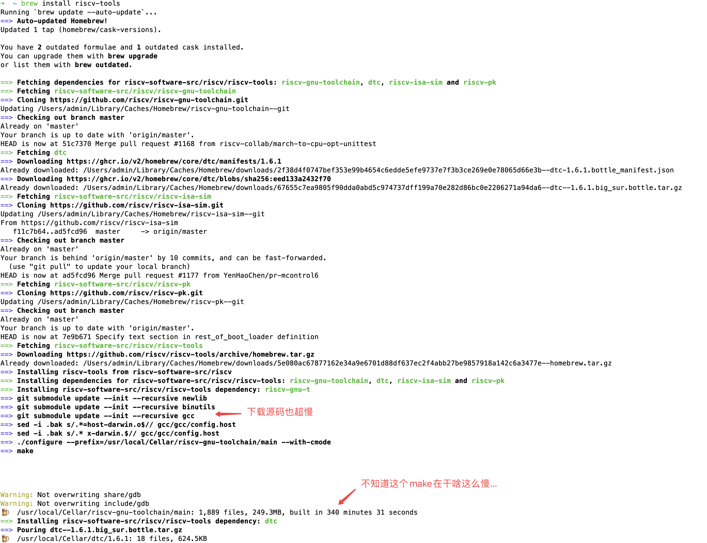
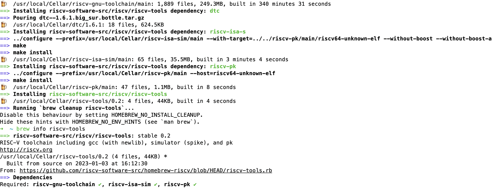

# Xv6 环境配置

假期开始，先试着把xv6的实验环境搭建起来，之后做不做实验等到以后再说......

根据官方的[指导教程](https://pdos.csail.mit.edu/6.828/2020/tools.html)，在macOS下配置实验环境需要做如下准备

- 安装git *早就安装好了*
- 安装qemu
- 安装risc-v的工具链

---

## 安装risc-v工具链

使用如下命令安装 (见 https://github.com/riscv-software-src/homebrew-riscv)

```bash
brew tap riscv-software-src/riscv
brew install riscv-tools
```

在实际安装时发现`brew`经常会在某个地方卡住完全不动了(git下载仓库时)，中断后重试几次都是一样。后来在网上发现别人也碰到了类似的问题(见 https://zhayujie.com/mit6828-env.html)，按照该博主的说法，我们只需要安装`riscv-gnu-toolchain`即可。但下载好源码编译时出现了各种warning，甚至还有error(但貌似还是可以编译出可执行文件的，可能会少一些东西)，根据官网的描述(见 https://github.com/riscv-collab/riscv-gnu-toolchain)，在OS X上编译需要保证文件系统是大小写敏感的，但很可惜macOS使用的文件系统不是大小写敏感的......

要解决如上问题可以创建一个大小写敏感的文件系统镜像并挂载到本地的某个目录上，方法见 https://github.com/spryker/spryker-docs/blob/master/docs/scos/dev/tutorials-and-howtos/howtos/howto-handle-case-sensitive-file-system-on-mac-os.md ，将源码放到该目录下再编译即可。

最后感觉太麻烦了，还是决定试一试`brew`能否成功，执行如下命令

```bash
brew tap riscv-software-src/riscv
brew install riscv-tools
```

执行开始后本人就去摆烂了，终于在六个小时(左右)后，安装成功完成了





至此`riscv`工具链安装完毕。

---

## 安装qemu

理论上来说非常简单，一条命令搞定

```bash
brew install qemu
```

安装完毕，搞定。

---

尝试启动xv6，如下

```bash
cd path/to/lab
git clone git://g.csail.mit.edu/xv6-labs-2020
git checkout util
make qemu
```

在macOS下编译时编译器会报如下错误

```bash
riscv64-linux-gnu-gcc -Wall -Werror -O -fno-omit-frame-pointer -ggdb -MD -mcmodel=medany -ffreestanding -fno-common -nostdlib -mno-relax -I. -fno-stack-protector -fno-pie -no-pie   -c -o user/sh.o user/sh.c
user/sh.c: In function 'runcmd':
user/sh.c:58:1: error: infinite recursion detected [-Werror=infinite-recursion]
   58 | runcmd(struct cmd *cmd)
      | ^~~~~~
user/sh.c:89:5: note: recursive call
   89 |     runcmd(rcmd->cmd);
      |     ^~~~~~~~~~~~~~~~~
user/sh.c:109:7: note: recursive call
  109 |       runcmd(pcmd->left);
      |       ^~~~~~~~~~~~~~~~~~
user/sh.c:116:7: note: recursive call
  116 |       runcmd(pcmd->right);
      |       ^~~~~~~~~~~~~~~~~~~
user/sh.c:95:7: note: recursive call
   95 |       runcmd(lcmd->left);
      |       ^~~~~~~~~~~~~~~~~~
user/sh.c:97:5: note: recursive call
   97 |     runcmd(lcmd->right);
      |     ^~~~~~~~~~~~~~~~~~~
user/sh.c:127:7: note: recursive call
  127 |       runcmd(bcmd->cmd);
      |       ^~~~~~~~~~~~~~~~~
cc1: all warnings being treated as errors
make: *** [<builtin>: user/sh.o] Error 1
```

将`Makefile`中`CFLAGS`的`-Werror`选项去掉即可。

但编译完成后悲惨的发现，启动qemu后程序就卡住了，没有任何交互行为。根据官方[指导](https://pdos.csail.mit.edu/6.828/2020/tools.html)的描述，qemu版本太新可能会出现这个问题。经过查找资料，brew貌似没有办法安装旧版本的qemu，只好在[qemu官网](https://www.qemu.org/download/#source)上下载qemu 4.2后通过[源码](https://download.qemu.org/)来安装qemu了，方法如下

```bash
cd path/to/lab
mkdir qemu-build   # 在该目录下下载源码并安装
cd qemu-build
wget https://download.qemu.org/qemu-4.2.1.tar.xz # 下载源码压缩包
tar xvJf qemu-4.2.1.tar.xz   # 解压
cd qemu-4.2.1
./configure
make # 编译
```

需要花费几十分钟来完成编译，编译后`riscv64-softmmu`目录内的`qemu-system-riscv64`即为需要的可执行文件，做一个软连接如下

```bash
cd riscv64-softmmu
ln -s $(pwd)/qemu-system-riscv64 /usr/local/bin/qemu-system-riscv64
```

之后重新尝试`make qemu`，可以正常启动`xv6`操作系统。

---

## 在docker下配置环境

在docker下拉取ubuntu镜像，以该镜像启动容器

```bash
docker run -it --name xv6 \
	-v ...:.../path/to/lab  \ # 挂载本地目录
	-p ...:...              \ # 端口映射
	ubuntu:latest
```

接着在该容器内先装些最基本的东西 c/c++的工具链(gcc/c++和各种库、包)、git、cmake、等各种东西。

---

### 安装riscv-tools

根据官方[指导](https://pdos.csail.mit.edu/6.828/2020/tools.html)，使用如下命令安装

```bash
apt-get install gcc-riscv64-linux-gnu binutils-riscv64-linux-gnu 
```

这个安装速度比mac下用brew拉取源码编译快得多了。

顺带安装一些可能是调试工具的包

```bash
apt-get install gdb-multiarch
```

---

### 安装qemu

根据官方[指导](https://pdos.csail.mit.edu/6.828/2020/tools.html)，使用如下命令安装

```bash
apt-get install qemu-system-misc
```

很遗憾，现在的qemu经过两年的改进，和macOS上一样，新版本的qemu启动后就卡死。按照指导，使用如下命令卸载并安装老版本

```bash
apt-get remove qemu-system-misc    # 卸载
apt-get install qemu-system-misc=1:4.2-3ubuntu6  # 安装老版本
```

但今非昔比了，上述安装方法会提示找不到该版本的qemu。

---

按照[指导](https://pdos.csail.mit.edu/6.828/2020/tools.html)，也可以进行源码安装

```bash
wget https://download.qemu.org/qemu-5.1.0.tar.xz  # 下载源码 qemu 5.1.0
tar xf qemu-5.1.0.tar.xz                          # 解压
cd qemu-5.1.0                                        
./configure --disable-kvm --disable-werror --prefix=/usr/local --target-list="riscv64-softmmu"
make
make install
```

---

在ubuntu环境下`make qemu`不会报`infinite recursion`的错误。

---

## 尾声

到此xv6就可以正常启动了，有可能以后还会碰到其他的问题，等到以后再说吧。