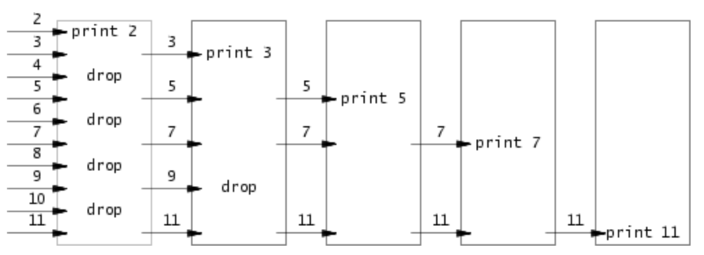

# xv6 util lab

在闲暇之余，抽出了一部分时间看了看MIT 6.S081课程的实验一，这个实验可能也许是最简单的一个实验了吧，完全没有涉及到操作系统内部原理相关的知识，只是用xv6的系统调用编写用户态的程序。我也不知道花了不知道多久，断断续续的把实验一干完了。该实验的实验要求见 https://pdos.csail.mit.edu/6.828/2020/labs/util.html.

---

## 准备

编译并使用qemu模拟启动操作系统方法为

```bash
make qemu
```

打分测试的命令如下

```bash
make grade
```

测试某个具体的用例，如测试sleep，方法有两种

```bash
./grade-lab-util sleep   # 第一种方法
make GRADEFLAGS=sleep grade # 第二种方法
```

---

## sleep

该任务非常简单，写一个sleep程序，能通过命令行参数指定sleep的tick数(tick指一个时钟周期)。程序非常简单，在`user`目录下新建文件`sleep.c`，编写代码如下

```c
#include "kernel/types.h"
#include "kernel/stat.h"
#include "user/user.h"

int
main(int argc, char *argv[])
{
  if(argc <= 1){
    write(1,"error: no input from user !\n",28);
    exit(-1);
  }
  sleep(atoi(argv[1]));   // sleep 为系统调用  参数为tick数，将命令行参数通过atoi转为整数即可
  exit(0);
}
```

编写完成后还需要修改`Makefile`中的`UPROGS`(这应该是user programs的意思)，添加sleep，如下

```makefile
U=user   # 用户态程序目录

UPROGS=\
	$U/_cat\
	$U/_echo\
	$U/_forktest\
	$U/_grep\
	$U/_init\
	$U/_kill\
	$U/_ln\
	$U/_ls\
	$U/_mkdir\
	$U/_rm\
	$U/_sh\
	$U/_stressfs\
	$U/_usertests\
	$U/_grind\
	$U/_wc\
	$U/_zombie\
	$U/_sleep   # 这是添加的一行内容
```

修改后`make qemu`进入xv6系统可以看到多出了一个sleep程序。该程序能通过打分程序。

---

## pingpong

这个也很简单，直接贴上`user/pingpong.c`代码如下

```c
#include "kernel/types.h"
#include "kernel/stat.h"
#include "user/user.h"

int
main(int argc, char *argv[])
{
  int p1[2],p2[2];
  char byte;   // byte
	
  // 两条管道 双向通信
  pipe(p1);  // parent to child
  pipe(p2);  // child to parent

  if(fork() != 0){ // parent
    close(p2[1]);
    close(p1[0]);
    write(p1[1],"0",1); // write a byte
    read(p2[0],&byte,1);      // read a byte
    printf("%d: received pong\n",getpid());
    close(p2[0]);
    close(p1[1]);
    exit(0);
  }else{ // child
    close(p2[0]);
    close(p1[1]);
    read(p1[0],&byte,1);      // read a byte
    printf("%d: received ping\n",getpid());
    write(p2[1],&byte,1); // write a byte
    close(p2[1]);
    close(p1[0]);
    exit(0);
  }
}
```

---

## primes

该任务需要编写程序输出2~35中的所有质数，比较特殊的要求是使用并发的方式来筛选质数，算法描述见 http://swtch.com/~rsc/thread/

### 算法描述

用一张图来描述这个筛选质数的并发算法，如下



上图中每一个框框为一个独立执行的例程(可以是process、thread或者别的什么比如golang中的goroutine，总之是可以并发执行的一段程序)，每一个例程可以给右边的邻居发送筛选出来的有可能是质数的数，每一个例程都会进行相应的筛选，选出来的数发给右边的邻居。

其中第一个例程会收到2-MAX所有的数字，收到的第一个数字当做质数输出(显然第一个数是2，是质数)。第一个例程知道2是质数了，那第一个例程接下来收到的所有数字，如果可以被2整除，那一定不是质数，不能被2整除的有可能是质数，将有可能是质数的数发送给右边的邻居，右边的邻居做进一步的筛选。

接下来看第二个例程，可以确定的是，第二个例程收到的第一个例程的第一个数字一定也是个质数。为什么呢？第二个例程收到的第一个数字(记作p)一定大于2(大于前一个例程认定了是质数的数)，所有小于p的质数(目前来看就是2)都不是p的因子，那p肯定也是质数。所以第二个例程可以将收到的第一个数认定为质数，将其输出。接下来收到的数字，第二个例程将检测是否能被p整除，若不能才可能是质数，第二个例程会将有可能是质数的数发给右边的邻居（即第三个例程）。显然第三个例程收到的数字一定不会被前两个质数整除，那么第三个例程收到的第一个数字也是个质数......

用数学归纳法可以容易看出，每个例程收到的第一个数都是质数，且每一个例程都会把可能是质数的数发给右邻居进一步筛选，每一个例程行为的伪代码描述为

```c
p = get a number from left neighbor
print p
loop:
    n = get a number from left neighbor
    if (p does not divide n)
        send n to right neighbor
```

### 算法实现

这个任务就要实现这一个算法。在我的实现中，使用进程作为一个独立的例程，主进程负责发送2-35所有的数字，然后开启第一个进程进行筛选，接着每一个进程根据需要判断是否需要开启右邻居，先看主进程代码如下

```c
int main(int argc,char *argv[]){
    int p;
    int to[2];
    int status;
    pipe(to);  // to 是主进程发送2~35所有数字给第一个例程所用的管道
    
    if(fork() != 0){ // parent
        close(to[0]); // do not read   不用的资源尽快close 主进程用该管道不需要读
        for(p = 2;p <= 35;p++)
            write(to[1],&p,sizeof(p));  // 将2~35所有数字写入管道
        close(to[1]);
    }else{ // child
        worker(to); // 子进程，即上面示意图中的例程，接收父进程发送的数字
        exit(0);
    }
    wait(&status);  // 主进程等待子进程结束
    exit(0);
}
```

接着来看看每一个例程的描述函数`worker`的实现，`worker`完全按照前文的伪代码实现

```c
void worker(int from[]){ // 参数为接收左邻居数字的管道
    int forked = 0;  // 标记是否开启过右邻居进程
    int to[2];
    close(from[1]); // do not write to from   该管道我只使用读端，不使用写端，没用的资源尽快释放
    int p;  // 接收第一个数字
    read(from[0],&p,sizeof(p)); // read first p
    printf("prime %d\n",p);   // 第一个数字一定是质数
    int t; // 接收数字
    while(read(from[0],&t,sizeof(t) != 0)){ // 该循环里面不断接收数字，挑出可能是质数的数字发给右邻居
        if(t % p != 0){  // t有可能是质数  这需要发给右邻居了
            if(!forked){  // 还没有右邻居
                pipe(to); // 创建和右邻居通信的管道
                if(fork() != 0){ // parent
                    close(to[0]);// 本进程关闭管道读端
                }else{ // child
                    worker(to);  // 子进程从to读取数字
                    exit(0);
                }
                forked = 1;  // 标记已经开启过子进程
            }
            write(to[1],&t,sizeof(t)); // 发送t给子进程
        }
    }
  	// 释放资源
    close(from[0]);
    close(to[1]);
  	// 等待右邻居退出
    int status;
    wait(&status);
}
```

以上两段代码实现了该任务。

---

另外吐槽一下，经过我的尝试，下面这段代码也是可以通过测试的，看来MIT的测试也不过是验证输出罢了...

```c
int is_prime(int n){
    int p = n/2;
    for(int i = 2; i <= p;i++){
        if(n % p == 0)
            return 0;
    }
    return 1;
}

int
main(int argc, char *argv[])
{
  for(int i =2;i <= 35;i++){
    if(is_prime(i))
        printf("prime %d\n",i);
  }
  exit(0);
}
```

---

## find

该任务需要实现一个极简版的`find`，功能如下所述

```bash
find <path> <filename>
```

在`<path>`路径中搜索文件名为`<filename>`的文件，示例如下

```bash
$ make qemu
...
init: starting sh
$ echo > b
$ mkdir a
$ echo > a/b
$ find . b
./b
./a/b
$
```

### xv6的目录项

在类unix系统中一般使用基于inode的文件系统(可以参考上交的《现代操作系统:原理与实现》个人感觉挺不错)，在这种文件系统下，`inode`记录了一个文件的所有内容存在disk的位置，所以知道了`inode`就知道了某一个文件。在类UNIX系统下目录也是普通的文件，文件内存着一个个目录项，即记录着inode号和其他一些文件信息，在xv6内，目录项如下

```c
// kernel/fs.h

// Directory is a file containing a sequence of dirent structures.
#define DIRSIZ 14

struct dirent {
  ushort inum;  // inode number 
  char name[DIRSIZ];  // filename
};
```

### fstat和stat

xv6中获取文件信息的系统调用为`fstat`，使用该函数还封装了一个用户态下的工具函数`stat`，两个函数原型如下

```c
// system call
int fstat(int fd, struct stat*); // fd 为文件描述符

// ulib.c
int stat(const char*, struct stat*);
int stat(const char *n, struct stat *st) // 函数定义
{
  int fd;
  int r;

  fd = open(n, O_RDONLY);
  if(fd < 0)
    return -1;
  r = fstat(fd, st);
  close(fd);
  return r;
}
```

其中描述文件信息的结构定义如下

```c
#define T_DIR     1   // Directory
#define T_FILE    2   // File
#define T_DEVICE  3   // Device

struct stat {
  int dev;     // File system's disk device
  uint ino;    // Inode number
  short type;  // Type of file
  short nlink; // Number of links to file
  uint64 size; // Size of file in bytes
};
```

---

### 实现

有了上面的铺垫，容易编写`find`代码如下

```c
void find(char *path,char *filename){ // 该函数在 path 内找 文件名为filename的文件
    int fd;
    struct stat st;
    struct dirent de;
    char buff[512];
    char *p;

    strcpy(buff,path);  // 路径复制到buff里
    p = buff + strlen(buff);
    *p ++ = '/'; // path 后加一个 /

    if((fd = open(path,0)) < 0){ // 打开path这个目录文件
        fprintf(2,"find: cannot open file:%s\n",path);
        return;
    }

    if(fstat(fd,&st) < 0){  // 没能获取文件信息
        fprintf(2,"find: cannot stat\n");
        close(fd);
        return;
    }
    
    if(st.type != T_DIR){  // path 不是目录文件
        fprintf(2,"find: path:%s is not a directory\n",path);
        close(fd);
        return;
    }

    while(read(fd,&de,sizeof(de)) == sizeof(de)){ // 遍历每一个目录项
      	// 无效的inode  或者. 和 ..都不继续搜索
        if(de.inum == 0 || strcmp(de.name,".") == 0 || strcmp(de.name,"..") == 0)
            continue;
        strcpy(p,de.name); // path/filename
        stat(buff,&st);    // 获取文件信息
        switch (st.type)
        {
        case T_FILE:  // 普通文件
            if(strcmp(de.name,filename) == 0)
                printf("%s\n",buff);
            break;
        case T_DIR: // 目录文件则递归搜索
            find(buff,filename); // find recursively
            break;
        default:
            break;
        }
    }
}
```

主函数编写如下

```c
int main(int argc,char *argv[]){
    if(argc <= 2){
        fprintf(2,"find: no enough argument\n");
        exit(-1);
    }
    find(argv[1],argv[2]);

    exit(0);
}
```

---

## xargs

该任务要求实现一个极简版的`xargs`，貌似也没什么好解释的，就是熟悉`fork`和`exec`即可，直接粘代码如下

```c
#include "kernel/types.h"
#include "kernel/stat.h"
#include "user/user.h"
#include "kernel/fs.h"
#include "kernel/param.h"

#define EOF -1

int getchar(){
    char ch;
    if(read(0,&ch,sizeof(ch)) <= 0)
        return EOF;

    return (int)ch;
}

int readline(char *buf){
    int ch;
    while((ch = getchar()) != '\n' && ch != EOF)
        *buf++ = ch;
    *buf = 0;
    
    if(ch == EOF)
        return EOF;
    return 1;
}

int main(int argc,char *argv[]){
    char buf[512];

    if(argc <= 1){
        fprintf(2,"xarg: no enough arguments\n");
        exit(-1);
    }

    int p = 0,q;
    char *command = argv[1];
    char *args[MAXARG];
    args[p++] = command;
    for(int i = 2;i < argc;i++)
        args[p++] = argv[i]; // arguments from argv
    
    q = p;
    while(readline(buf) != EOF){
        args[q] = malloc(strlen(buf));
        strcpy(args[q++],buf);
    }
    args[q] = 0;

    int status;

    if(fork() == 0){ // child
        exec(command,args);
    }else{ // father
        wait(&status);
    }

    for(;p < q;p ++)
        free(args[p]);

    exit(0);
}
```

---

## 尾声

说实话不知道这个MIT 6.S081还能坚持多久，能坚持一个lab就多坚持一个吧☺️

代码放到 https://github.com/XieWeikai/xv6_lab 的 `lab1`分支啦，但目前该仓库还是private的，等到这个课程真的完成的差不多了再准备公开了哈哈哈。
