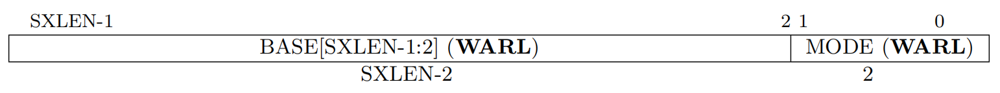
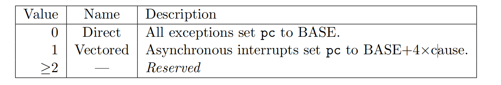
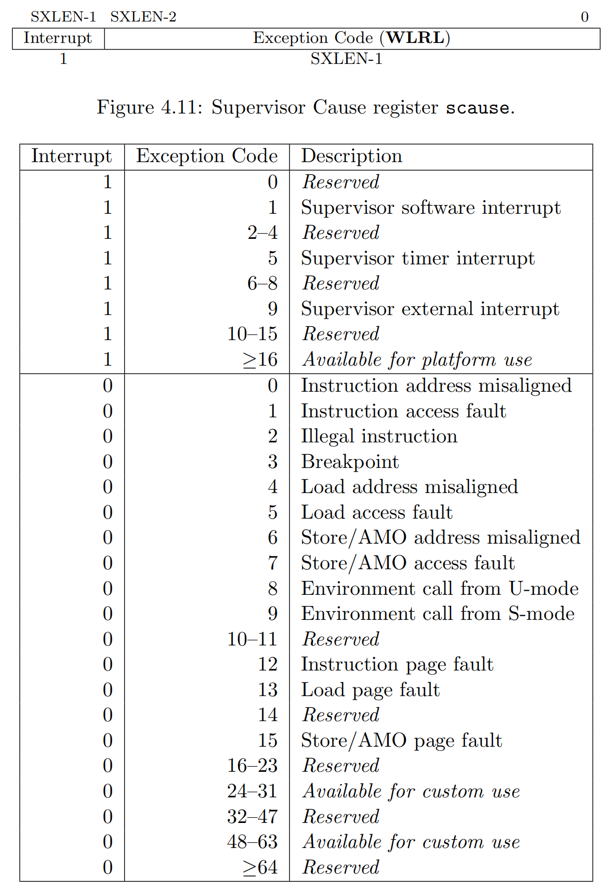
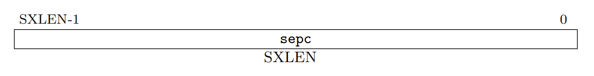
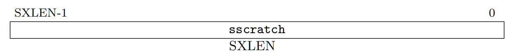
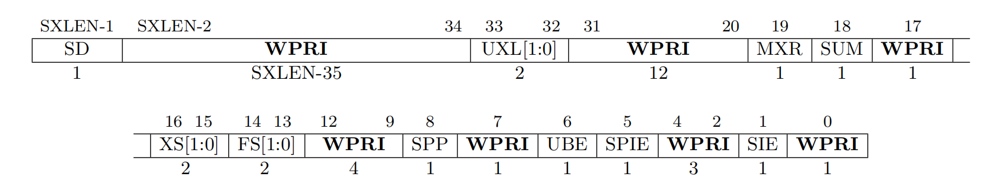

# risc-v 中断机制

操作系统中很多功能都需要依赖于中断机制，比如系统调用相当于一种中断、各类硬件可以通过中断来通知内核已经完成了一些工作、通过计时器中断来进行进程调度等等等等，总之中断是非常重要的。在这篇文章中先介绍关于中断的内容，以方便下一个实验的进行。

在riscv处理器中，中断有很多，中断也是可以分级的，就像是privilege mode有machine mode、supervisor mode、user mode，中断陷入的privilege mode可以是machine mode也可以是supervisor mode。一般来讲中断都交给machine mode处理，但是内核运行在supervisor mode，内核处理某些中断才能完成许多任务，故可以通过修改machine mode下某些csr寄存器来讲中断授权给supervisor mode，即中断陷入supervisor mode，而不是由machine mode处理。通过查看手册，可以知道通过`medeleg`和`mideleg`两个寄存器控制可以将哪些中断授权给supervisor mode.在xv6中start.c中的`start`函数内有如下代码将所有中断授权给supervisor mode

```c
// delegate all interrupts and exceptions to supervisor mode.
w_medeleg(0xffff);
w_mideleg(0xffff);
w_sie(r_sie() | SIE_SEIE | SIE_STIE | SIE_SSIE);
```

medeleg和mideleg中的e和i分别指exception和interruption，额，关于exception和interrupt的区别，貌似exception是同步的，interrupt是异步的，估计后面会接触到的，暂时先不管。

本篇文章大致介绍一下有关系的寄存器。

## stvec

$stvec$是一个很重要的寄存器，这个寄存器标志着产生中断后，处理器应当跳转到哪个地址处执行代码，该寄存器全称为 **Supervisor Trap Vector Base Address Register**，如下图，这个寄存器分为两个部分



上图中的$XLEN$代指寄存器宽度，$SXLEN$开头的S指$Supervisor$，**WARL**意义见之前的文章:[satp寄存器](../mit-6.s081-page-table-代码解析/#satp寄存器)。图中两个部分作用为:

- **MODE**:控制中断跳转方式。
- **BASE**：存4字节对齐的地址的高$SXLEN-2$位，如若寄存器长64位，一处地址为64位，且4字节对齐(即第二位为0)，则**BASE**要记录该地址只需记录高62位。

接着看看**MODE**的作用，按照riscv文档，**MODE**可选两个值，如下



如果MODE设为0，则中断产生后直接跳转到BASE设置的地址(即BASE低位填两个0作为地址)，如果MODE设为1，则BASE处为一个向量(类似x86中的中断向量表)，4字节为一个元素，每4字节看成一个地址，中断产生时跳转到$BASE+4\times cause$位置存的地址处，其中cause为中断原因号，其值在后文介绍。

---

## scause

产生中断的源有很多，比如时钟中断、除以0、页错误、ecall等等，系统需要一种方法得到产生中断的原因。risc-v处理器产生中断后会将中断原因对应编号存入scause寄存器中，该寄存器全称为**Supervisor Cause Register**，寄存器结构即中断原因号如下图所示



由上表可以看到，在用户态执行ecall产生的中断对应中断号为8，且interrupt位为0.

---

## sepc

sepc寄存器全称为 **Supervisor Exception Program Counter**，中断产生后，跳转到处理中断的代码，由于之后可能还需要返回原来的位置执行，故中断产生时会将当时的pc保存在sepc寄存器中。这也是一个**WARL**的寄存器。



---

## sscratch

全称**Supervisor Scratch Register**，这是一个可随意读写的寄存器，没有规定具体的作用，可以给内核随意使用。



但按照惯例，这个寄存器一般用于给内核存一些有用的东西，然后在中断产生时可以使用这个寄存器来做一些事。具体怎么回事等以后解析xv6的中断例程时再说。

---

## sstatus

全称 **Supervisor Status Register**，这个寄存器结构如下所示(64位)



重要的位介绍如下

- **SIE**:S-mode interrupt-enable bit，如果该位置为1，则允许supervisor下的中断产生，否则supervisor下的中断都会被延迟至该位置1才产生。处于较低的privilege mode时该位无论为什么值，supervisor mode相关的中断都会产生。
- **SPP**:记录着产生中断前的privilege mode，如果为0，则说明是user mode下产生的中断，如果是1，则说明是supervisor mode下产生的中断。
- **SPIE**:记录着中断产生时**SIE**的值。

当一次中断产生时，**SPP**被设置为产生中断时的privilege mode，**SIE**被设置为0，原先的**SIE**被存入**SPIE**。当执行`sret`指令从中断返回时，如果**SPP**为1则切换到supervisor mode，0则切换到user mode(即spp是什么就切换到什么模式)，然后**SIE**被设为**SPIE**的值，**SPIE**设为1，**SPP**设为user mode(即0).